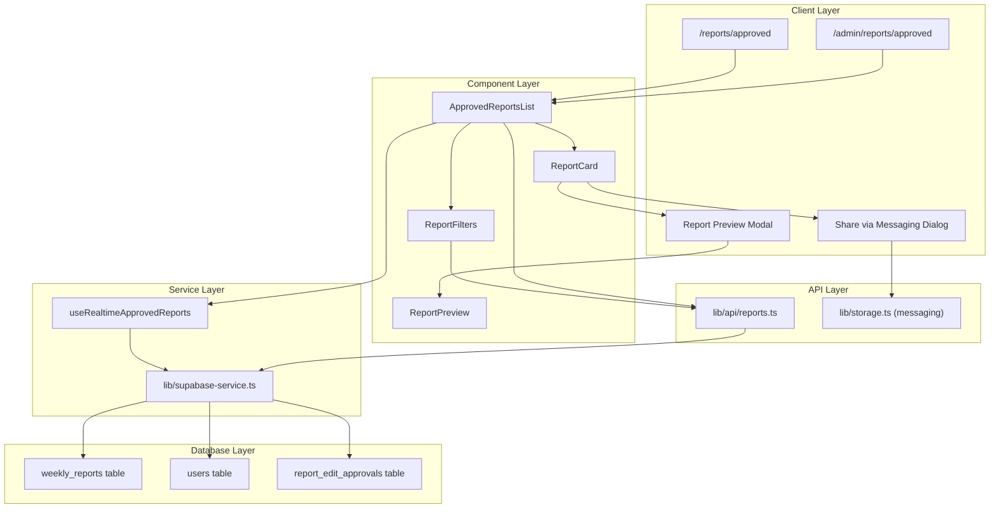

# Design Document: Approved Reports Viewer

## Overview

The Approved Reports Viewer feature provides a dedicated interface for viewing, managing, and sharing approved reports within the staff portal. The system implements role-based access control with two distinct user experiences: Admins can access all approved reports across all departments, while Staff members can access approved reports with role-appropriate permissions.

The feature integrates seamlessly with the existing Next.js application architecture, leveraging Supabase for real-time data synchronization, shadcn/ui components for consistent UI patterns, and the existing messaging system for report sharing capabilities.

### Key Capabilities

- Role-based report viewing (Admin: all departments, Staff: accessible reports)
- Comprehensive filtering system (date range, week, year, name, department, author)
- Report preview in read-only modal
- Report download with timestamped filenames
- Role-based editing permissions (Admin: own reports, Staff: with approval)
- Integration with existing messaging system for report sharing
- Pagination support for large report lists
- Real-time updates via Supabase subscriptions

## Architecture

### High-Level Architecture



### Routing Structure

The feature implements two separate routes based on user role:

- **Admin Route**: `/admin/reports/approved` - Full access to all approved reports
- **Staff Route**: `/reports/approved` - Access to reports with staff permissions

Both routes share the same underlying components but with different data filtering and permission logic.

### Data Flow

1. **Initial Load**: Page component fetches approved reports based on user role
2. **Filtering**: User applies filters → API call with filter parameters → Filtered results displayed
3. **Real-time Updates**: Supabase subscription monitors report approval changes → Auto-refresh list
4. **Preview**: User clicks preview → Modal opens with read-only report content
5. **Download**: User clicks download → Report file generated with timestamp → Browser download initiated
6. **Edit**: User clicks edit → Permission check → Navigate to editor or show error message
7. **Share**: User clicks share → Messaging dialog opens with report reference → Message sent with report link

## Components and Interfaces

### Page Components

#### `/app/(protected)/admin/reports/approved/page.tsx`

Admin-specific page for viewing all approved reports.

```typescript
export default function AdminApprovedReportsPage() {
  const { user } = useAuth();
  
  // Fetch all approved reports (no department filtering)
  // Render ApprovedReportsList with admin permissions
  // Handle navigation and state management
}
```

#### `/app/(protected)/reports/approved/page.tsx`

Staff-specific page for viewing accessible approved reports.

```typescript
export default function StaffApprovedReportsPage() {
  const { user } = useAuth();
  
  // Fetch approved reports accessible to staff member
  // Render ApprovedReportsList with staff permissions
  // Handle navigation and state management
}
```

### Core Components

#### `ApprovedReportsList`

Main component that orchestrates the approved reports viewing experience.

```typescript
interface ApprovedReportsListProps {
  userRole: 'admin' | 'staff';
  userId: string;
  userDepartment?: Department;
}

export function ApprovedReportsList({
  userRole,
  userId,
  userDepartment
}: ApprovedReportsListProps) {
  // State management for reports, filters, pagination
  // Real-time subscription for report updates
  // Render ReportFilters and ReportCard components
  // Handle preview, download, edit, share actions
}
```

**Key Responsibilities**:
- Fetch and display approved reports based on user role
- Manage filter state and apply filters to report list
- Handle pagination logic
- Coordinate actions (preview, download, edit, share)
- Subscribe to real-time report updates

#### `ReportFilters`

Comprehensive filtering interface for narrowing down report results.

```typescript
interface ReportFiltersProps {
  onFilterChange: (filters: ReportFilterState) => void;
  availableDepartments: Department[];
  userRole: 'admin' | 'staff';
}

interface ReportFilterState {
  dateRange?: { start: string; end: string };
  week?: { week: number; year: number };
  year?: number;
  name?: string;
  department?: Department;
  author?: string;
}

export function ReportFilters({
  onFilterChange,
  availableDepartments,
  userRole
}: ReportFiltersProps) {
  // Render filter inputs with debouncing for text fields
  // Handle filter state changes
  // Provide clear filters functionality
  // Display active filter count
}
```

**Key Responsibilities**:
- Render all filter input controls
- Debounce text input filters (300ms)
- Calculate ISO 8601 week numbers
- Emit filter changes to parent component
- Display active filter indicators

#### `ReportCard`

Individual report display card with action buttons.

```typescript
interface ReportCardProps {
  report: WeeklyReport;
  userRole: 'admin' | 'staff';
  userId: string;
  onPreview: (report: WeeklyReport) => void;
  onDownload: (report: WeeklyReport) => void;
  onEdit: (report: WeeklyReport) => void;
  onShare: (report: WeeklyReport) => void;
}

export function ReportCard({
  report,
  userRole,
  userId,
  onPreview,
  onDownload,
  onEdit,
  onShare
}: ReportCardProps) {
  // Display report metadata (name, department, author, approval date)
  // Render action buttons based on permissions
  // Handle action button clicks
}
```

**Key Responsibilities**:
- Display report information in card format
- Show appropriate action buttons based on user permissions
- Trigger action callbacks when buttons are clicked

#### `ReportPreview`

Read-only modal for previewing report content.

```typescript
interface ReportPreviewProps {
  report: WeeklyReport;
  isOpen: boolean;
  onClose: () => void;
}

export function ReportPreview({
  report,
  isOpen,
  onClose
}: ReportPreviewProps) {
  // Render report content in read-only format
  // Preserve original formatting and structure
  // Display in modal dialog
}
```

**Key Responsibilities**:
- Render rich text content from TipTap JSON format
- Display media links and attachments
- Maintain read-only state (no editing)
- Handle modal open/close state

#### `ShareReportDialog`

Dialog for sharing reports via the messaging system.

```typescript
interface ShareReportDialogProps {
  report: WeeklyReport;
  isOpen: boolean;
  onClose: () => void;
  onShare: (recipientId: string, message: string) => Promise<void>;
}

export function ShareReportDialog({
  report,
  isOpen,
  onClose,
  onShare
}: ShareReportDialogProps) {
  // Display user selection interface
  // Pre-populate message with report reference
  // Handle message sending
}
```

**Key Responsibilities**:
- Provide user selection interface
- Generate report link for message content
- Integrate with messaging API
- Handle share completion

### Hooks

#### `useRealtimeApprovedReports`

Custom hook for subscribing to real-time report approval updates.

```typescript
interface UseRealtimeApprovedReportsOptions {
  userId: string;
  userRole: 'admin' | 'staff';
  onReportApproved: (report: WeeklyReport) => void;
  onReportUpdated: (report: WeeklyReport) => void;
}

export function useRealtimeApprovedReports({
  userId,
  userRole,
  onReportApproved,
  onReportUpdated
}: UseRealtimeApprovedReportsOptions) {
  // Subscribe to weekly_reports table changes
  // Filter for approval_status = 'approved'
  // Apply role-based filtering
  // Emit callbacks for relevant changes
  
  return {
    isConnected: boolean;
    isReconnecting: boolean;
  };
}
```

**Key Responsibilities**:
- Establish Supabase real-time subscription
- Filter events based on user role and permissions
- Notify parent component of relevant changes
- Manage connection state

## Data Models

### Database Schema Extensions

#### New Table: `report_edit_approvals`

Tracks admin approvals for staff members to edit specific reports.

```sql
CREATE TABLE report_edit_approvals (
  id UUID PRIMARY KEY DEFAULT uuid_generate_v4(),
  report_id UUID NOT NULL REFERENCES weekly_reports(id) ON DELETE CASCADE,
  staff_id VARCHAR(50) NOT NULL REFERENCES users(staff_id) ON DELETE CASCADE,
  approved_by VARCHAR(50) NOT NULL REFERENCES users(staff_id),
  approved_at TIMESTAMP WITH TIME ZONE DEFAULT NOW(),
  expires_at TIMESTAMP WITH TIME ZONE,
  created_at TIMESTAMP WITH TIME ZONE DEFAULT NOW(),
  
  UNIQUE(report_id, staff_id)
);

CREATE INDEX idx_report_edit_approvals_report ON report_edit_approvals(report_id);
CREATE INDEX idx_report_edit_approvals_staff ON report_edit_approvals(staff_id);
CREATE INDEX idx_report_edit_approvals_expires ON report_edit_approvals(expires_at);
```

### TypeScript Interfaces

#### `ReportEditApproval`

```typescript
export interface ReportEditApproval {
  id: string;
  reportId: string;
  staffId: string;
  approvedBy: string;
  approvedAt: number;
  expiresAt?: number;
  createdAt: number;
}
```

#### `ApprovedReportWithAuthor`

Extended report interface with author information for display.

```typescript
export interface ApprovedReportWithAuthor extends WeeklyReport {
  authorName: string;
  authorDepartment: Department;
  approvedByName?: string;
}
```

#### `ReportFilterParams`

API parameters for filtering reports.

```typescript
export interface ReportFilterParams {
  startDate?: string;
  endDate?: string;
  week?: number;
  year?: number;
  name?: string;
  department?: Department;
  authorName?: string;
  page?: number;
  pageSize?: number;
}
```

#### `PaginatedReportsResponse`

API response with pagination metadata.

```typescript
export interface PaginatedReportsResponse {
  reports: ApprovedReportWithAuthor[];
  totalCount: number;
  page: number;
  pageSize: number;
  totalPages: number;
}
```

### API Endpoints

#### `getApprovedReports`

Fetch approved reports with filtering and pagination.

```typescript
export async function getApprovedReports(
  userRole: 'admin' | 'staff',
  userId: string,
  filters?: ReportFilterParams
): Promise<PaginatedReportsResponse>
```

**Logic**:
1. Query `weekly_reports` table with `approval_status = 'approved'`
2. Apply role-based filtering:
   - Admin: No department filtering
   - Staff: Filter by accessible departments (implementation-specific)
3. Apply filter parameters:
   - Date range: Filter by `reviewed_at` between start and end dates
   - Week/Year: Calculate date range from ISO 8601 week number
   - Name: Case-insensitive partial match on `week` field
   - Department: Exact match on `department` field
   - Author: Join with `users` table, case-insensitive partial match on `name`
4. Join with `users` table to get author information
5. Apply pagination (default: 20 per page)
6. Return paginated results with metadata

#### `checkEditPermission`

Check if a user has permission to edit a specific report.

```typescript
export async function checkEditPermission(
  userId: string,
  reportId: string,
  userRole: 'admin' | 'staff'
): Promise<{ canEdit: boolean; reason?: string }>
```

**Logic**:
1. Fetch report from database
2. If user role is 'admin':
   - Check if `report.staffId === userId`
   - Return `{ canEdit: true }` if match, else `{ canEdit: false, reason: 'Can only edit own reports' }`
3. If user role is 'staff':
   - Query `report_edit_approvals` table for matching record
   - Check if approval exists and hasn't expired
   - Return `{ canEdit: true }` if approved, else `{ canEdit: false, reason: 'Admin approval required' }`

#### `downloadReport`

Generate and download report file.

```typescript
export async function downloadReport(
  reportId: string
): Promise<{ filename: string; content: Blob }>
```

**Logic**:
1. Fetch report from database
2. Convert rich content to appropriate format (HTML, PDF, or JSON)
3. Generate filename: `{report.week}_{timestamp}.{extension}`
4. Return file data for browser download

#### `shareReportViaMessaging`

Share report link through messaging system.

```typescript
export async function shareReportViaMessaging(
  senderId: string,
  recipientId: string,
  reportId: string,
  reportName: string,
  customMessage?: string
): Promise<void>
```

**Logic**:
1. Generate report link: `/reports/approved?reportId={reportId}`
2. Construct message content:
   ```
   {customMessage}
   
   Shared Report: {reportName}
   View Report: {reportLink}
   ```
3. Call existing `addMessage` function with constructed content
4. Message type: 'text'


## Correctness Properties

*A property is a characteristic or behavior that should hold true across all valid executions of a system—essentially, a formal statement about what the system should do. Properties serve as the bridge between human-readable specifications and machine-verifiable correctness guarantees.*

### Property 1: Admin Access to All Approved Reports

*For any* set of approved reports across multiple departments, when an Admin user queries the approved reports viewer, the system should return all approved reports regardless of department.

**Validates: Requirements 1.1**

### Property 2: Staff Access to Permitted Reports

*For any* Staff user with specific department access permissions, when querying the approved reports viewer, the system should return only approved reports that the staff member has permission to access.

**Validates: Requirements 2.1**

### Property 3: Report Card Display Completeness

*For any* approved report displayed in the viewer, the rendered report card should contain the report name, department, author name, and approval date.

**Validates: Requirements 1.2, 2.2**

### Property 4: Pagination Correctness

*For any* collection of approved reports exceeding the page size, the pagination metadata (total count, page number, total pages) should accurately reflect the complete dataset, and each page should contain at most the specified page size of reports.

**Validates: Requirements 1.3, 2.3**

### Property 5: Preview Content Completeness

*For any* approved report, when rendered in preview mode, all report content fields (rich content, media links, metadata) should be present in the preview display.

**Validates: Requirements 3.2**

### Property 6: Preview Format Preservation

*For any* approved report with rich text content, the preview should render the content structure identically to the original TipTap JSON format without modification.

**Validates: Requirements 3.3**

### Property 7: Download Format Preservation

*For any* approved report, the downloaded file content should match the original report content without data loss or corruption.

**Validates: Requirements 4.2**

### Property 8: Download Filename Generation

*For any* approved report, the generated download filename should contain both the report name and a timestamp in the format `{reportName}_{timestamp}.{extension}`.

**Validates: Requirements 4.3**

### Property 9: Admin Edit Permission

*For any* approved report and Admin user, the edit permission check should return true if and only if the Admin is the author of the report.

**Validates: Requirements 5.1, 5.2**

### Property 10: Staff Edit Permission

*For any* approved report and Staff user, the edit permission check should return true if and only if a valid (non-expired) edit approval exists for that staff member and report.

**Validates: Requirements 6.2, 6.3**

### Property 11: Share Message Content

*For any* approved report being shared via messaging, the generated message content should include the report ID, report name, and a valid clickable link to the report in the approved reports viewer.

**Validates: Requirements 7.2, 7.3**

### Property 12: Date Range Filter Accuracy

*For any* date range filter (start date, end date) and collection of approved reports, the filtered results should include only reports with approval dates greater than or equal to the start date and less than or equal to the end date.

**Validates: Requirements 8.1**

### Property 13: Week Filter Accuracy

*For any* week number and year combination, the filtered results should include only reports with approval dates falling within that ISO 8601 week.

**Validates: Requirements 9.1**

### Property 14: Year Filter Accuracy

*For any* year value, the filtered results should include only reports with approval dates falling within that calendar year.

**Validates: Requirements 9.2**

### Property 15: ISO 8601 Week Calculation

*For any* date value, the calculated week number should match the ISO 8601 standard week calculation (week starts on Monday, week 1 contains the first Thursday of the year).

**Validates: Requirements 9.3**

### Property 16: Name Filter Substring Matching

*For any* text search query and collection of approved reports, the filtered results should include only reports whose names contain the search text as a substring.

**Validates: Requirements 10.1**

### Property 17: Name Filter Case Insensitivity

*For any* text search query, searching with different case variations (uppercase, lowercase, mixed case) should return identical result sets.

**Validates: Requirements 10.2**

### Property 18: Department Filter Accuracy

*For any* department selection and collection of approved reports, the filtered results should include only reports belonging to the selected department.

**Validates: Requirements 11.1**

### Property 19: Staff Department Filter Options

*For any* Staff user, the available department filter options should include only departments that the staff member has access to view.

**Validates: Requirements 11.3**

### Property 20: Author Filter Matching

*For any* author name search query and collection of approved reports, the filtered results should include only reports authored by users whose names contain the search text.

**Validates: Requirements 12.1**

### Property 21: Author Filter Case Insensitivity

*For any* author name search query, searching with different case variations should return identical result sets.

**Validates: Requirements 12.2**

### Property 22: Author Filter Full Name Matching

*For any* author name search query, the filter should match against both the first name and last name of report authors, returning reports where either name component contains the search text.

**Validates: Requirements 12.3**

### Property 23: Multiple Filter AND Logic

*For any* combination of multiple filter criteria (date range, department, author, name), the filtered results should include only reports that satisfy all specified criteria simultaneously.

**Validates: Requirements 13.1**

### Property 24: Filter Result Count Accuracy

*For any* active filter configuration, the displayed result count should equal the actual number of reports in the filtered result set.

**Validates: Requirements 13.3**

## Error Handling

### Error Categories

#### 1. Data Fetching Errors

**Scenarios**:
- Database connection failures
- Network timeouts
- Invalid query parameters
- Insufficient permissions

**Handling Strategy**:
- Display user-friendly error messages using the existing error toast system
- Provide retry functionality for transient errors
- Log detailed error information for debugging
- Gracefully degrade to empty state with explanation

**Implementation**:
```typescript
try {
  const reports = await getApprovedReports(userRole, userId, filters);
  setReports(reports.reports);
} catch (error) {
  const dbError = mapDatabaseError(error);
  showErrorToast(dbError, {
    onRetry: () => fetchReports(),
  });
  setReports([]);
}
```

#### 2. Permission Errors

**Scenarios**:
- User attempts to edit report without permission
- User attempts to access reports outside their department
- Edit approval has expired

**Handling Strategy**:
- Display clear permission denial messages
- Explain why access is denied
- Provide guidance on how to obtain permission (e.g., "Contact an admin for edit approval")
- Do not expose sensitive information about other users or departments

**Implementation**:
```typescript
const { canEdit, reason } = await checkEditPermission(userId, reportId, userRole);
if (!canEdit) {
  showErrorToast({
    message: reason || 'You do not have permission to edit this report',
    code: 'PERMISSION_DENIED',
  });
  return;
}
```

#### 3. Download Errors

**Scenarios**:
- Report content is corrupted or missing
- File generation fails
- Browser blocks download

**Handling Strategy**:
- Validate report content before generating download
- Provide fallback download formats
- Display clear error messages if download fails
- Offer alternative access methods (e.g., preview instead)

#### 4. Real-time Subscription Errors

**Scenarios**:
- WebSocket connection drops
- Subscription fails to establish
- Reconnection attempts fail

**Handling Strategy**:
- Display connection status indicator
- Automatically attempt reconnection with exponential backoff
- Allow manual refresh if real-time updates fail
- Continue functioning with manual refresh as fallback

**Implementation**:
```typescript
const { isConnected, isReconnecting } = useRealtimeApprovedReports({
  userId,
  userRole,
  onReportApproved: handleNewApprovedReport,
  onReportUpdated: handleReportUpdate,
});

// Display connection status
<ConnectionStatus
  status={isConnected ? 'online' : isReconnecting ? 'reconnecting' : 'offline'}
  showLabel={true}
/>
```

#### 5. Filter Validation Errors

**Scenarios**:
- Invalid date format
- Invalid week number (< 1 or > 53)
- Invalid year value
- Malformed search queries

**Handling Strategy**:
- Validate inputs before applying filters
- Display inline validation errors
- Prevent invalid filter submissions
- Provide input format hints

**Implementation**:
```typescript
const validateDateRange = (start: string, end: string): boolean => {
  const startDate = new Date(start);
  const endDate = new Date(end);
  
  if (isNaN(startDate.getTime()) || isNaN(endDate.getTime())) {
    showErrorToast({
      message: 'Invalid date format. Please use YYYY-MM-DD format.',
      code: 'INVALID_DATE_FORMAT',
    });
    return false;
  }
  
  if (startDate > endDate) {
    showErrorToast({
      message: 'Start date must be before end date.',
      code: 'INVALID_DATE_RANGE',
    });
    return false;
  }
  
  return true;
};
```

### Error Recovery Patterns

#### Optimistic UI Updates

For actions like sharing reports, implement optimistic updates with rollback on failure:

```typescript
// Optimistically update UI
setShareStatus('sending');

try {
  await shareReportViaMessaging(senderId, recipientId, reportId, reportName);
  setShareStatus('success');
  showSuccessToast('Report shared successfully');
} catch (error) {
  // Rollback optimistic update
  setShareStatus('idle');
  const dbError = mapDatabaseError(error);
  showErrorToast(dbError, {
    onRetry: () => handleShare(),
  });
}
```

#### Graceful Degradation

If real-time updates fail, fall back to polling or manual refresh:

```typescript
useEffect(() => {
  if (!isConnected && !isReconnecting) {
    // Fall back to polling every 30 seconds
    const pollInterval = setInterval(() => {
      refreshReports();
    }, 30000);
    
    return () => clearInterval(pollInterval);
  }
}, [isConnected, isReconnecting]);
```

## Testing Strategy

### Dual Testing Approach

The approved-reports-viewer feature will be validated using both unit tests and property-based tests to ensure comprehensive coverage:

- **Unit tests**: Verify specific examples, edge cases, error conditions, and integration points
- **Property tests**: Verify universal properties across all inputs using randomized test data

### Unit Testing Focus Areas

Unit tests should focus on:

1. **Specific Examples**:
   - Admin viewing reports from multiple departments
   - Staff viewing reports with specific permissions
   - Preview modal opening with correct report data
   - Download generating correct filename format

2. **Edge Cases**:
   - Empty report list
   - Single report in list
   - Exactly page size number of reports
   - Reports with missing optional fields (media links, feedback)
   - Expired edit approvals
   - Reports with very long names or content

3. **Error Conditions**:
   - Database connection failures during fetch
   - Permission denied scenarios
   - Invalid filter parameters
   - Real-time subscription failures
   - Download generation errors

4. **Integration Points**:
   - Messaging system integration for sharing
   - Navigation to report editor
   - Real-time subscription setup and teardown
   - Filter state synchronization with URL parameters

### Property-Based Testing Configuration

**Library**: fast-check (JavaScript/TypeScript property-based testing library)

**Configuration**:
- Minimum 100 iterations per property test
- Each test tagged with feature name and property reference
- Custom generators for domain-specific types (reports, users, filters)

**Tag Format**:
```typescript
// Feature: approved-reports-viewer, Property 1: Admin Access to All Approved Reports
```

### Property Test Implementation Examples

#### Property 1: Admin Access to All Approved Reports

```typescript
import fc from 'fast-check';

// Feature: approved-reports-viewer, Property 1: Admin Access to All Approved Reports
test('Admin users receive all approved reports regardless of department', async () => {
  await fc.assert(
    fc.asyncProperty(
      fc.array(approvedReportArbitrary(), { minLength: 1, maxLength: 50 }),
      fc.adminUserArbitrary(),
      async (reports, adminUser) => {
        // Setup: Insert reports into database
        await insertReports(reports);
        
        // Action: Query as admin
        const result = await getApprovedReports('admin', adminUser.id, {});
        
        // Assert: All approved reports returned
        expect(result.reports.length).toBe(reports.length);
        
        // Verify all departments represented
        const reportDepts = new Set(reports.map(r => r.department));
        const resultDepts = new Set(result.reports.map(r => r.department));
        expect(resultDepts).toEqual(reportDepts);
        
        // Cleanup
        await cleanupReports(reports);
      }
    ),
    { numRuns: 100 }
  );
});
```

#### Property 9: Admin Edit Permission

```typescript
// Feature: approved-reports-viewer, Property 9: Admin Edit Permission
test('Admin can edit own reports but not others', async () => {
  await fc.assert(
    fc.asyncProperty(
      fc.approvedReportArbitrary(),
      fc.adminUserArbitrary(),
      fc.adminUserArbitrary(),
      async (report, authorAdmin, otherAdmin) => {
        fc.pre(authorAdmin.id !== otherAdmin.id); // Ensure different admins
        
        // Setup: Create report authored by authorAdmin
        const reportWithAuthor = { ...report, staffId: authorAdmin.staffId };
        await insertReport(reportWithAuthor);
        
        // Test 1: Author can edit
        const authorPermission = await checkEditPermission(
          authorAdmin.id,
          reportWithAuthor.id,
          'admin'
        );
        expect(authorPermission.canEdit).toBe(true);
        
        // Test 2: Other admin cannot edit
        const otherPermission = await checkEditPermission(
          otherAdmin.id,
          reportWithAuthor.id,
          'admin'
        );
        expect(otherPermission.canEdit).toBe(false);
        expect(otherPermission.reason).toContain('own reports');
        
        // Cleanup
        await cleanupReport(reportWithAuthor);
      }
    ),
    { numRuns: 100 }
  );
});
```

#### Property 12: Date Range Filter Accuracy

```typescript
// Feature: approved-reports-viewer, Property 12: Date Range Filter Accuracy
test('Date range filter returns only reports within range', async () => {
  await fc.assert(
    fc.asyncProperty(
      fc.array(approvedReportArbitrary(), { minLength: 10, maxLength: 50 }),
      fc.dateRangeArbitrary(),
      fc.adminUserArbitrary(),
      async (reports, dateRange, adminUser) => {
        // Setup: Insert reports with various approval dates
        await insertReports(reports);
        
        // Action: Apply date range filter
        const result = await getApprovedReports('admin', adminUser.id, {
          startDate: dateRange.start,
          endDate: dateRange.end,
        });
        
        // Assert: All returned reports within range
        const startTime = new Date(dateRange.start).getTime();
        const endTime = new Date(dateRange.end).getTime();
        
        for (const report of result.reports) {
          const approvalTime = report.reviewedAt!;
          expect(approvalTime).toBeGreaterThanOrEqual(startTime);
          expect(approvalTime).toBeLessThanOrEqual(endTime);
        }
        
        // Assert: No reports outside range are included
        const expectedCount = reports.filter(r => {
          const time = r.reviewedAt!;
          return time >= startTime && time <= endTime;
        }).length;
        expect(result.reports.length).toBe(expectedCount);
        
        // Cleanup
        await cleanupReports(reports);
      }
    ),
    { numRuns: 100 }
  );
});
```

#### Property 23: Multiple Filter AND Logic

```typescript
// Feature: approved-reports-viewer, Property 23: Multiple Filter AND Logic
test('Multiple filters combine with AND logic', async () => {
  await fc.assert(
    fc.asyncProperty(
      fc.array(approvedReportArbitrary(), { minLength: 20, maxLength: 100 }),
      fc.multipleFiltersArbitrary(),
      fc.adminUserArbitrary(),
      async (reports, filters, adminUser) => {
        // Setup: Insert diverse set of reports
        await insertReports(reports);
        
        // Action: Apply multiple filters
        const result = await getApprovedReports('admin', adminUser.id, filters);
        
        // Assert: All returned reports match ALL filter criteria
        for (const report of result.reports) {
          // Check date range if specified
          if (filters.startDate && filters.endDate) {
            const time = report.reviewedAt!;
            expect(time).toBeGreaterThanOrEqual(new Date(filters.startDate).getTime());
            expect(time).toBeLessThanOrEqual(new Date(filters.endDate).getTime());
          }
          
          // Check department if specified
          if (filters.department) {
            expect(report.department).toBe(filters.department);
          }
          
          // Check name if specified
          if (filters.name) {
            expect(report.week.toLowerCase()).toContain(filters.name.toLowerCase());
          }
          
          // Check author if specified
          if (filters.authorName) {
            expect(report.authorName.toLowerCase()).toContain(filters.authorName.toLowerCase());
          }
        }
        
        // Assert: Count matches expected
        const expectedReports = reports.filter(r => matchesAllFilters(r, filters));
        expect(result.reports.length).toBe(expectedReports.length);
        
        // Cleanup
        await cleanupReports(reports);
      }
    ),
    { numRuns: 100 }
  );
});
```

### Custom Generators (Arbitraries)

Property-based tests require custom generators for domain-specific types:

```typescript
// Generate random approved reports
function approvedReportArbitrary(): fc.Arbitrary<WeeklyReport> {
  return fc.record({
    id: fc.uuid(),
    staffId: fc.string({ minLength: 5, maxLength: 10 }),
    week: fc.string({ minLength: 10, maxLength: 30 }),
    summary: fc.lorem({ maxCount: 50 }),
    challenges: fc.lorem({ maxCount: 50 }),
    goals: fc.lorem({ maxCount: 50 }),
    richContent: fc.jsonObject(),
    formatType: fc.constantFrom('word', 'spreadsheet', 'presentation'),
    status: fc.constant('submitted'),
    approvalStatus: fc.constant('approved'),
    department: fc.constantFrom(...allDepartments),
    reviewedBy: fc.string({ minLength: 5, maxLength: 10 }),
    reviewedAt: fc.date({ min: new Date('2020-01-01'), max: new Date('2025-12-31') }).map(d => d.getTime()),
    createdAt: fc.date({ min: new Date('2020-01-01'), max: new Date('2025-12-31') }).map(d => d.getTime()),
  });
}

// Generate random admin users
function adminUserArbitrary(): fc.Arbitrary<User> {
  return fc.record({
    id: fc.uuid(),
    staffId: fc.string({ minLength: 5, maxLength: 10 }),
    name: fc.fullName(),
    email: fc.emailAddress(),
    department: fc.constantFrom(...allDepartments),
    role: fc.constant('admin'),
  });
}

// Generate random date ranges
function dateRangeArbitrary(): fc.Arbitrary<{ start: string; end: string }> {
  return fc.date({ min: new Date('2020-01-01'), max: new Date('2025-12-31') })
    .chain(startDate => 
      fc.date({ min: startDate, max: new Date('2025-12-31') })
        .map(endDate => ({
          start: startDate.toISOString().split('T')[0],
          end: endDate.toISOString().split('T')[0],
        }))
    );
}

// Generate random filter combinations
function multipleFiltersArbitrary(): fc.Arbitrary<ReportFilterParams> {
  return fc.record({
    startDate: fc.option(fc.date().map(d => d.toISOString().split('T')[0]), { nil: undefined }),
    endDate: fc.option(fc.date().map(d => d.toISOString().split('T')[0]), { nil: undefined }),
    department: fc.option(fc.constantFrom(...allDepartments), { nil: undefined }),
    name: fc.option(fc.string({ minLength: 2, maxLength: 10 }), { nil: undefined }),
    authorName: fc.option(fc.string({ minLength: 2, maxLength: 10 }), { nil: undefined }),
  });
}
```

### Test Coverage Goals

- **Unit Test Coverage**: Minimum 80% code coverage for all components and API functions
- **Property Test Coverage**: All 24 correctness properties implemented as property-based tests
- **Integration Test Coverage**: All critical user flows tested end-to-end
- **Error Handling Coverage**: All error scenarios tested with appropriate error messages

### Testing Best Practices

1. **Isolation**: Each test should be independent and not rely on other tests
2. **Cleanup**: Always clean up test data after each test run
3. **Determinism**: Use seeded random generators for reproducible test failures
4. **Performance**: Keep property test iterations reasonable (100-200) to maintain fast test suite
5. **Documentation**: Tag each property test with its corresponding design property
6. **Failure Analysis**: When property tests fail, log the failing example for debugging

