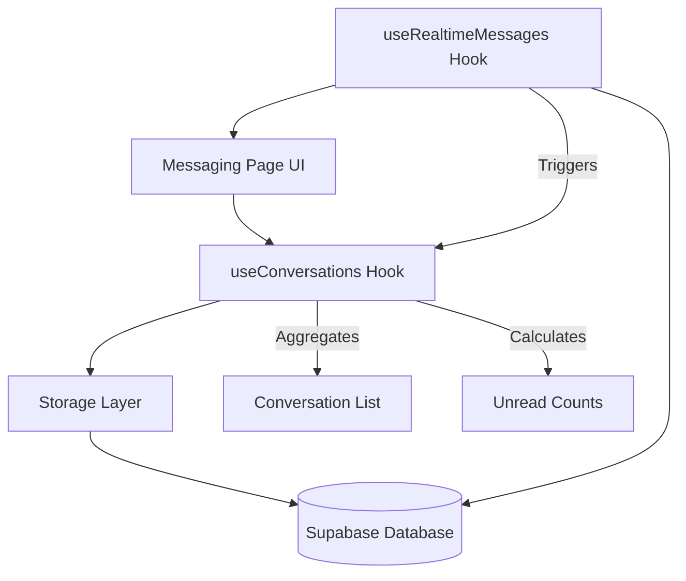
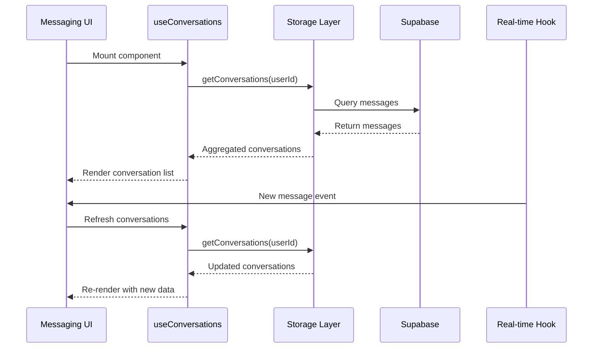

# Design Document: Messaging Notifications and Recents

## Overview

This design document specifies the technical implementation for replacing mock conversation data with real database-driven conversations, implementing unread message notifications, sorting conversations by recent activity, and providing visual indicators for message status.

The system will aggregate messages from the Supabase database into conversation objects, calculate unread counts per conversation, and update the UI in real-time using the existing `useRealtimeMessages` hook. The design focuses on efficient data aggregation, minimal database queries, and seamless integration with the existing messaging infrastructure.

### Key Design Goals

- Replace `mockConversations` with dynamically generated conversation list from database
- Aggregate message data to show last message, timestamp, and unread count per conversation
- Implement real-time updates for conversation list when new messages arrive
- Provide clear visual indicators (badges, bold text, background colors) for unread messages
- Sort conversations by most recent activity
- Mark messages as read when user opens a conversation
- Maintain compatibility with existing `useRealtimeMessages` hook

## Architecture

### High-Level Architecture



### Component Interaction Flow

1. **Initial Load**: `useConversations` hook fetches all messages for current user and aggregates into conversations
2. **Real-time Updates**: `useRealtimeMessages` hook detects new messages and triggers conversation list refresh
3. **User Interaction**: When user opens conversation, messages are marked as read and conversation list updates
4. **Visual Updates**: UI components react to conversation state changes and display appropriate indicators

### Data Flow



## Components and Interfaces

### 1. useConversations Hook

A custom React hook that manages conversation state and provides conversation aggregation logic.

**Interface:**
```typescript
interface UseConversationsOptions {
  userId: string | undefined;
  refreshTrigger?: number; // Increment to force refresh
}

interface ConversationData {
  id: string; // Derived from participant IDs
  participantIds: string[];
  otherUser: User;
  lastMessage: Message | null;
  lastMessageTime: number;
  unreadCount: number;
}

interface UseConversationsReturn {
  conversations: ConversationData[];
  totalUnreadCount: number;
  isLoading: boolean;
  error: Error | null;
  refreshConversations: () => Promise<void>;
}

function useConversations(options: UseConversationsOptions): UseConversationsReturn
```

**Responsibilities:**
- Fetch all messages for current user from database
- Aggregate messages into conversation objects
- Calculate unread counts per conversation
- Sort conversations by most recent activity
- Provide refresh mechanism for real-time updates

### 2. Storage Layer Functions

New functions to be added to `lib/storage.ts`:

**getConversations:**
```typescript
interface ConversationSummary {
  otherUserId: string;
  lastMessage: Message | null;
  lastMessageTime: number;
  unreadCount: number;
}

async function getConversations(userId: string): Promise<ConversationSummary[]>
```

This function will:
- Query all messages where user is sender or recipient
- Group messages by conversation partner
- For each conversation, extract last message, timestamp, and count unread messages
- Return sorted by most recent activity

**markConversationAsRead:**
```typescript
async function markConversationAsRead(
  userId: string,
  otherUserId: string
): Promise<void>
```

This function will:
- Update all unread messages in a conversation to `read = true`
- Only mark messages where current user is the recipient

### 3. UI Components

**ConversationListItem:**
A component to render individual conversation items with visual indicators.

```typescript
interface ConversationListItemProps {
  conversation: ConversationData;
  isActive: boolean;
  onClick: () => void;
}
```

Visual states:
- **Unread**: Bold text, distinct background color, badge with count
- **Read**: Normal text, standard background
- **Active**: Highlighted with accent color border

**UnreadBadge:**
A component to display unread message count.

```typescript
interface UnreadBadgeProps {
  count: number;
  size?: 'sm' | 'md' | 'lg';
}
```

### 4. Integration Points

**Messaging Page Updates:**
- Replace `mockConversations` with `useConversations` hook
- Add `refreshTrigger` state that increments when new message arrives
- Call `markConversationAsRead` when user opens a conversation
- Display total unread count in navigation (future enhancement)

**Real-time Integration:**
- `useRealtimeMessages` already handles new message events
- Add logic to increment `refreshTrigger` when new message arrives
- Conversation list will automatically refresh and re-sort

## Data Models

### Conversation Aggregation Model

```typescript
interface ConversationData {
  // Unique identifier derived from sorted participant IDs
  id: string; // e.g., "conv-user1-user2"
  
  // Participant information
  participantIds: string[]; // [currentUserId, otherUserId]
  otherUser: User; // Full user object of conversation partner
  
  // Message metadata
  lastMessage: Message | null; // Most recent message in conversation
  lastMessageTime: number; // Timestamp of last message (for sorting)
  unreadCount: number; // Count of unread messages for current user
}
```

### Database Query Strategy

**Efficient Conversation Aggregation:**

Instead of multiple queries, use a single query with aggregation:

```sql
WITH user_messages AS (
  SELECT 
    CASE 
      WHEN sender_id = $1 THEN recipient_id 
      ELSE sender_id 
    END as other_user_id,
    *
  FROM messages
  WHERE sender_id = $1 OR recipient_id = $1
),
latest_messages AS (
  SELECT DISTINCT ON (other_user_id)
    other_user_id,
    id,
    sender_id,
    recipient_id,
    type,
    content,
    file_url,
    read,
    created_at
  FROM user_messages
  ORDER BY other_user_id, created_at DESC
),
unread_counts AS (
  SELECT 
    other_user_id,
    COUNT(*) as unread_count
  FROM user_messages
  WHERE recipient_id = $1 AND read = FALSE
  GROUP BY other_user_id
)
SELECT 
  lm.*,
  COALESCE(uc.unread_count, 0) as unread_count
FROM latest_messages lm
LEFT JOIN unread_counts uc ON lm.other_user_id = uc.other_user_id
ORDER BY lm.created_at DESC;
```

This query:
- Identifies all conversation partners
- Gets the most recent message for each conversation
- Counts unread messages per conversation
- Returns sorted by most recent activity
- Executes in a single database round-trip

### Conversation ID Generation

Generate deterministic conversation IDs from participant IDs:

```typescript
function generateConversationId(userId1: string, userId2: string): string {
  // Sort to ensure consistent ID regardless of order
  const sorted = [userId1, userId2].sort();
  return `conv-${sorted[0]}-${sorted[1]}`;
}
```

## Correctness Properties

*A property is a characteristic or behavior that should hold true across all valid executions of a system-essentially, a formal statement about what the system should do. Properties serve as the bridge between human-readable specifications and machine-verifiable correctness guarantees.*


### Property 1: Conversation List Filtering

*For any* user and any set of messages in the database, the conversation list should only include users with whom the current user has exchanged at least one message (either as sender or recipient).

**Validates: Requirements 1.2**

### Property 2: Last Message Data Accuracy

*For any* conversation with messages, the displayed last message content and timestamp should match the message with the most recent timestamp in that conversation.

**Validates: Requirements 1.3, 1.4**

### Property 3: Department Display Accuracy

*For any* conversation, the displayed department should match the department field of the other user in that conversation.

**Validates: Requirements 1.5**

### Property 4: Unread Count Per Conversation

*For any* conversation, the displayed unread count should equal the number of messages in that conversation where the current user is the recipient and read status is false.

**Validates: Requirements 2.1**

### Property 5: Total Unread Count Aggregation

*For any* user, the total unread count should equal the sum of unread counts across all of that user's conversations.

**Validates: Requirements 2.2**

### Property 6: Visual Styling Based on Unread Status

*For any* conversation, if the unread count is greater than zero, the conversation should be displayed with bold text and a distinct background color; if the unread count is zero, it should be displayed with normal styling.

**Validates: Requirements 3.1, 3.2, 3.3**

### Property 7: Conversation Sorting by Recent Activity

*For any* set of conversations, they should be sorted in descending order by the timestamp of their most recent message (most recent first).

**Validates: Requirements 4.1**

### Property 8: New Message Reordering

*For any* conversation list and any new message, after the message is added, the conversation containing that message should be at position 0 (top of the list).

**Validates: Requirements 4.2**

### Property 9: Mark as Read on Open

*For any* conversation with unread messages, when the current user opens that conversation, all messages in that conversation where the current user is the recipient should have their read status set to true.

**Validates: Requirements 5.1**

### Property 10: Read Status Persistence

*For any* message marked as read, querying that message from the database should return read status as true.

**Validates: Requirements 5.4**

### Property 11: UI Updates After Mark as Read

*For any* conversation where messages are marked as read, the unread count badge should decrease by the number of messages marked, and the visual styling should update to reflect the new unread status.

**Validates: Requirements 5.2, 5.3**

### Property 12: Notification Indicators for Unread Messages

*For any* conversation with unread messages, that conversation should display a notification indicator; when the user opens that conversation, the notification indicator should be cleared.

**Validates: Requirements 6.1, 6.2, 6.3**

## Error Handling

### Database Query Errors

**Scenario**: Database connection fails or query times out when fetching conversations

**Handling Strategy**:
- Display error toast with retry option
- Maintain last known conversation state in UI
- Log error details for debugging
- Provide fallback to empty state with clear error message

**Implementation**:
```typescript
try {
  const conversations = await getConversations(userId);
  setConversations(conversations);
  setError(null);
} catch (error) {
  const dbError = mapDatabaseError(error);
  setError(dbError);
  showErrorToast(dbError, {
    onRetry: () => refreshConversations(),
  });
}
```

### Real-time Connection Errors

**Scenario**: Real-time subscription fails or disconnects

**Handling Strategy**:
- Display connection status indicator (already implemented in `useRealtimeMessages`)
- Continue showing cached conversation data
- Attempt automatic reconnection
- Allow manual refresh of conversation list

**User Experience**:
- Show "Reconnecting..." status when connection is lost
- Show "Offline" status when connection fails
- Conversations remain functional with cached data
- Manual refresh button available

### Mark as Read Failures

**Scenario**: Marking messages as read fails due to network or database error

**Handling Strategy**:
- Optimistically update UI immediately
- Queue failed operations for retry
- Revert UI if operation fails after retry attempts
- Log failures for debugging

**Implementation**:
```typescript
// Optimistic update
setConversations(prev => 
  prev.map(conv => 
    conv.id === conversationId 
      ? { ...conv, unreadCount: 0 } 
      : conv
  )
);

try {
  await markConversationAsRead(userId, otherUserId);
} catch (error) {
  // Revert optimistic update
  refreshConversations();
  showErrorToast(mapDatabaseError(error));
}
```

### Empty State Handling

**Scenario**: User has no conversations yet

**Handling Strategy**:
- Display friendly empty state message
- Provide clear call-to-action to start a conversation
- Show "New Message" button prominently
- Include helpful guidance text

**UI Design**:
```typescript
{conversations.length === 0 && !isLoading && (
  <div className="flex flex-col items-center justify-center h-full p-8 text-center">
    <p className="text-lg mb-2">No conversations yet</p>
    <p className="text-sm opacity-60 mb-4">
      Start a conversation by clicking the "New Message" button below
    </p>
  </div>
)}
```

### Race Conditions

**Scenario**: Multiple real-time updates arrive simultaneously or conversation is opened while marking as read

**Handling Strategy**:
- Use React state updates with functional form to ensure consistency
- Debounce rapid refresh triggers
- Use message IDs to deduplicate updates
- Ensure database operations are idempotent

**Implementation**:
```typescript
// Functional state update to avoid race conditions
setConversations(prev => {
  const updated = [...prev];
  // Apply update logic
  return updated.sort((a, b) => b.lastMessageTime - a.lastMessageTime);
});
```

## Testing Strategy

### Dual Testing Approach

This feature will be tested using both unit tests and property-based tests to ensure comprehensive coverage:

**Unit Tests**: Focus on specific examples, edge cases, and integration points
- Empty conversation list rendering
- Single conversation with unread messages
- Conversation list with mixed read/unread states
- Mark as read integration with database
- Real-time update integration
- Error handling scenarios

**Property-Based Tests**: Verify universal properties across all inputs
- Conversation filtering correctness across random message sets
- Unread count calculations across random message states
- Sorting behavior across random conversation sets
- Visual styling consistency across random unread states
- Mark as read behavior across random conversation states

### Property-Based Testing Configuration

**Library**: We will use `fast-check` for TypeScript property-based testing

**Configuration**:
- Minimum 100 iterations per property test
- Each test tagged with feature name and property reference
- Tag format: `Feature: messaging-notifications-and-recents, Property {number}: {property_text}`

**Example Test Structure**:
```typescript
import fc from 'fast-check';

describe('Conversation Aggregation Properties', () => {
  it('Property 1: Conversation List Filtering', () => {
    // Feature: messaging-notifications-and-recents, Property 1
    fc.assert(
      fc.property(
        fc.array(messageArbitrary),
        fc.string(),
        (messages, userId) => {
          const conversations = aggregateConversations(messages, userId);
          
          // All conversations should involve the current user
          conversations.every(conv => 
            conv.participantIds.includes(userId)
          );
        }
      ),
      { numRuns: 100 }
    );
  });
});
```

### Test Data Generators

**Message Generator**:
```typescript
const messageArbitrary = fc.record({
  id: fc.uuid(),
  senderId: fc.string(),
  recipientId: fc.string(),
  content: fc.string(),
  timestamp: fc.integer({ min: 0 }),
  read: fc.boolean(),
});
```

**Conversation Generator**:
```typescript
const conversationArbitrary = fc.record({
  participantIds: fc.array(fc.string(), { minLength: 2, maxLength: 2 }),
  messages: fc.array(messageArbitrary, { minLength: 1 }),
});
```

### Integration Testing

**Real-time Update Testing**:
- Mock Supabase real-time events
- Verify conversation list updates when new message arrives
- Verify unread counts update correctly
- Verify sorting updates correctly

**Database Integration Testing**:
- Test against actual Supabase instance (test database)
- Verify SQL query returns correct aggregated data
- Verify mark as read updates database correctly
- Verify concurrent updates are handled correctly

### Unit Test Coverage Areas

1. **useConversations Hook**:
   - Initial load with various message states
   - Refresh trigger behavior
   - Error handling
   - Loading states

2. **Storage Functions**:
   - getConversations with empty database
   - getConversations with multiple conversations
   - markConversationAsRead success and failure
   - SQL query correctness

3. **UI Components**:
   - ConversationListItem rendering with unread messages
   - ConversationListItem rendering without unread messages
   - UnreadBadge display and hiding
   - Empty state rendering

4. **Integration Points**:
   - Messaging page integration with useConversations
   - Real-time update triggering conversation refresh
   - Mark as read when opening conversation
   - Conversation selection and message loading

### Edge Cases to Test

- Empty conversation list (no messages in database)
- Single conversation with single message
- Conversation with all messages read
- Conversation with all messages unread
- Multiple conversations with same timestamp
- Very large unread counts (>99)
- Rapid successive new messages
- Opening conversation while new message arrives
- Network failure during mark as read
- Database query timeout

## Implementation Plan

### Phase 1: Storage Layer (Foundation)

1. Implement `getConversations` function in `lib/storage.ts`
   - Write SQL query for conversation aggregation
   - Map database results to ConversationSummary interface
   - Add error handling and logging

2. Implement `markConversationAsRead` function
   - Write SQL update query
   - Handle edge cases (no unread messages, invalid user IDs)
   - Add error handling

3. Write unit tests for storage functions
   - Test with various database states
   - Test error scenarios
   - Verify SQL query correctness

### Phase 2: useConversations Hook

1. Create `hooks/use-conversations.ts`
   - Implement conversation fetching logic
   - Implement refresh mechanism
   - Add loading and error states
   - Integrate with storage layer

2. Add user data enrichment
   - Fetch user details for conversation partners
   - Map user data to conversation objects
   - Handle missing user data gracefully

3. Write unit tests for hook
   - Test initial load
   - Test refresh behavior
   - Test error handling
   - Test loading states

### Phase 3: UI Components

1. Create `ConversationListItem` component
   - Implement visual styling for unread/read states
   - Add unread badge
   - Add click handling
   - Ensure accessibility

2. Create `UnreadBadge` component
   - Implement badge styling
   - Handle different sizes
   - Implement hide when zero logic

3. Update messaging page
   - Replace mockConversations with useConversations hook
   - Add refresh trigger state
   - Integrate mark as read on conversation open
   - Add empty state handling

### Phase 4: Real-time Integration

1. Update messaging page real-time handling
   - Increment refresh trigger on new message
   - Update conversation list on message read events
   - Handle connection status changes

2. Test real-time behavior
   - Verify conversation list updates
   - Verify sorting updates
   - Verify unread counts update

### Phase 5: Property-Based Testing

1. Set up fast-check library
2. Write property tests for all 12 properties
3. Create test data generators
4. Run property tests with 100+ iterations
5. Fix any discovered edge cases

### Phase 6: Polish and Optimization

1. Add loading skeletons for better UX
2. Optimize database queries for performance
3. Add caching for user data
4. Implement debouncing for rapid updates
5. Add analytics/logging for monitoring

## Migration Strategy

### Gradual Rollout

1. **Phase 1**: Implement alongside mockConversations
   - Add feature flag to toggle between mock and real data
   - Test with real data in development
   - Keep mock data as fallback

2. **Phase 2**: Enable for testing
   - Enable real data for internal testing
   - Monitor for errors and performance issues
   - Gather feedback on UX

3. **Phase 3**: Full deployment
   - Remove mock data dependency
   - Remove feature flag
   - Monitor production metrics

### Backward Compatibility

- Maintain existing Message and User interfaces
- Keep existing useRealtimeMessages hook unchanged
- Ensure existing message sending/receiving works
- No breaking changes to database schema

### Data Migration

No data migration required - feature works with existing message data in database.

## Performance Considerations

### Database Query Optimization

- Use single aggregated query instead of multiple queries
- Add database indexes on frequently queried columns:
  - `messages(sender_id, created_at)`
  - `messages(recipient_id, created_at)`
  - `messages(recipient_id, read)` for unread count queries

### Caching Strategy

- Cache user data to avoid repeated lookups
- Cache conversation list with short TTL (5-10 seconds)
- Invalidate cache on real-time updates
- Use React Query or SWR for automatic cache management (future enhancement)

### Real-time Update Throttling

- Debounce rapid refresh triggers (max 1 refresh per second)
- Batch multiple simultaneous updates
- Use optimistic UI updates to reduce perceived latency

### Rendering Optimization

- Use React.memo for ConversationListItem to prevent unnecessary re-renders
- Virtualize conversation list for users with many conversations (future enhancement)
- Lazy load user avatars

## Security Considerations

### Data Access Control

- Verify user can only access their own conversations
- Use Supabase Row Level Security (RLS) policies
- Validate user IDs on server side
- Never expose other users' private message content

### SQL Injection Prevention

- Use parameterized queries for all database operations
- Validate and sanitize user inputs
- Use Supabase client's built-in protection

### Privacy

- Only load conversation metadata (last message preview, not full history)
- Respect user privacy settings
- Don't expose read receipts to senders (future consideration)

## Accessibility

### Keyboard Navigation

- Ensure conversation list is keyboard navigable
- Add proper focus indicators
- Support arrow keys for navigation
- Support Enter key to open conversation

### Screen Reader Support

- Add ARIA labels for unread badges
- Announce unread count changes
- Provide context for conversation items
- Use semantic HTML elements

### Visual Accessibility

- Ensure sufficient color contrast for unread indicators
- Don't rely solely on color for unread state (use bold text + color)
- Support high contrast mode
- Ensure badge text is readable at all sizes

## Future Enhancements

### Conversation Metadata

- Last message sender name in preview
- Typing indicators
- Message delivery status
- Read receipts (optional)

### Advanced Filtering

- Filter by unread only
- Filter by department
- Search within conversations
- Archive conversations

### Performance Optimizations

- Virtual scrolling for large conversation lists
- Pagination for message history
- Conversation list caching with SWR
- Optimistic updates for all operations

### User Experience

- Conversation pinning
- Mute notifications for specific conversations
- Custom notification sounds
- Desktop notifications

### Analytics

- Track conversation engagement metrics
- Monitor unread message trends
- Measure response times
- Track feature usage
