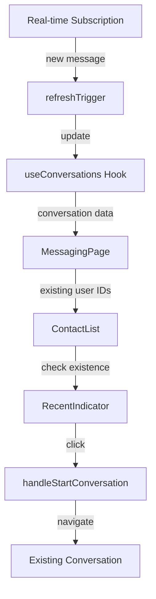

# Design Document: Messaging Recent Contacts Indicator

## Overview

This feature enhances the Toko 360 Staff Portal messaging system by adding visual indicators to the contact selection interface, helping users quickly identify which contacts have existing conversations. The design integrates seamlessly with the existing WhatsApp-like messaging interface, leveraging the current conversation management system and real-time infrastructure.

The solution adds a "Recent" indicator (icon + label) next to contacts in the "New Message" dialog who already have active conversations. When users select a contact with this indicator, the system navigates directly to the existing conversation rather than creating a new one. The indicator updates in real-time as conversations are created or received, maintaining synchronization with the conversation list.

### Key Design Decisions

1. **Visual Indicator Design**: Use a clock icon with "Recent" label for clarity and accessibility
2. **Data Source**: Leverage existing `useConversations` hook to determine which contacts have active conversations
3. **Real-time Updates**: Utilize existing real-time message subscription to trigger indicator updates
4. **Performance**: Implement efficient lookup using a Set data structure for O(1) contact checking
5. **Navigation**: Enhance existing conversation selection logic to handle indicator clicks

## Architecture

### Component Structure

```
MessagingPage (app/(protected)/messaging/page.tsx)
├── Dialog (New Message)
│   ├── Search Input
│   └── ContactList
│       └── ContactItem (enhanced)
│           ├── Avatar
│           ├── User Info
│           └── RecentIndicator (NEW)
└── ConversationList
    └── ConversationListItem (existing)
```

### Data Flow



### Integration Points

1. **useConversations Hook**: Provides list of active conversations with participant IDs
2. **Real-time Subscription**: Triggers conversation list refresh via `refreshTrigger`
3. **Contact Selection Dialog**: Enhanced to display indicators and handle navigation
4. **Conversation Navigation**: Modified to prioritize existing conversations

## Components and Interfaces

### 1. RecentIndicator Component (NEW)

A reusable component that displays the "Recent" indicator next to contacts with existing conversations.

```typescript
interface RecentIndicatorProps {
  size?: 'sm' | 'md';
  className?: string;
}

export function RecentIndicator({ 
  size = 'sm', 
  className 
}: RecentIndicatorProps): JSX.Element
```

**Responsibilities**:
- Render clock icon with "Recent" label
- Provide accessible ARIA labels
- Support theming via CSS variables
- Maintain consistent sizing

**Visual Design**:
- Icon: Clock icon (from lucide-react)
- Label: "Recent" text
- Color: Theme accent color with reduced opacity
- Size: Small (16px icon, 12px text) or Medium (20px icon, 14px text)
- Layout: Horizontal flex with 4px gap

### 2. Enhanced Contact Selection Logic

Modify the existing contact selection dialog in `MessagingPage` to:

**New State**:
```typescript
// Derived from conversations
const existingConversationUserIds = useMemo(() => 
  new Set(conversations.map(conv => conv.otherUser.id)),
  [conversations]
);
```

**Enhanced Contact Item Rendering**:
```typescript
{filteredAvailableUsers.map((availableUser) => {
  const hasExistingConversation = existingConversationUserIds.has(availableUser.id);
  
  return (
    <button
      key={availableUser.id}
      onClick={() => handleStartConversation(availableUser)}
      // ... existing props
    >
      <div className="flex items-center gap-3">
        {/* Existing avatar and user info */}
        {hasExistingConversation && <RecentIndicator size="sm" />}
      </div>
    </button>
  );
})}
```

### 3. Enhanced Navigation Logic

Modify `handleStartConversation` to prioritize existing conversations:

```typescript
const handleStartConversation = (selectedUser: User) => {
  // Check if conversation already exists
  const existingConv = conversations.find(
    c => c.otherUser.id === selectedUser.id
  );
  
  if (existingConv) {
    // Navigate to existing conversation
    setSelectedConvId(existingConv.id);
    
    // Load messages immediately
    loadMessagesForConversation(existingConv);
  } else {
    // Create temporary conversation ID for new conversation
    const newConvId = `conv-new-${selectedUser.id}`;
    setSelectedConvId(newConvId);
    setMessages([]);
  }
  
  // Close dialog and reset search
  setIsNewMessageDialogOpen(false);
  setSearchQuery('');
};
```

## Data Models

### Existing Models (No Changes Required)

The feature leverages existing data structures without modification:

**ConversationData** (from `use-conversations.ts`):
```typescript
interface ConversationData {
  id: string;
  participantIds: string[];
  otherUser: User;
  lastMessage: ConversationSummary['lastMessage'];
  lastMessageTime: number;
  unreadCount: number;
}
```

**User** (from `lib/types.ts`):
```typescript
interface User {
  id: string;
  staffId: string;
  name: string;
  department: string;
  avatar?: string;
  status: 'online' | 'offline';
}
```

### Derived Data Structures

**Existing Conversation Lookup**:
```typescript
// Efficient O(1) lookup for checking if user has existing conversation
type ExistingConversationSet = Set<string>; // Set of user IDs

// Created via:
const existingConversationUserIds = useMemo(() => 
  new Set(conversations.map(conv => conv.otherUser.id)),
  [conversations]
);
```

## Correctness Properties

*A property is a characteristic or behavior that should hold true across all valid executions of a system-essentially, a formal statement about what the system should do. Properties serve as the bridge between human-readable specifications and machine-verifiable correctness guarantees.*


### Property Reflection

After analyzing all testable acceptance criteria, I identified the following redundancies:

**Redundancy Analysis**:

1. **Properties 1.1 and 1.2** (indicator presence/absence): These are complementary but not redundant. Property 1.1 tests that contacts WITH conversations show indicators, while 1.2 tests that contacts WITHOUT conversations don't show indicators. Both are needed as they test different conditions.

2. **Properties 3.2 and 3.3** (synchronization): Property 3.3 is essentially a continuous version of 3.2. Since 3.2 already tests that indicators update when conversations change, and this happens continuously via real-time updates, 3.3 is redundant. **Decision: Remove 3.3, keep 3.2**.

3. **Properties 2.1 and 2.2** (navigation behavior): These test opposite conditions (with/without indicator) and different outcomes (open existing vs create new). Both are necessary and not redundant.

4. **Performance properties** (1.4, 2.3, 3.1, 5.1, 5.2): Each tests different performance aspects with different constraints. Not redundant.

5. **Accessibility properties** (4.1-4.4): These are all examples testing specific accessibility features. Not redundant as they test different aspects (ARIA labels, contrast, screen reader, keyboard).

**Final Property Set**: Remove property 3.3 as redundant with 3.2. All other properties provide unique validation value.

### Property 1: Indicator Display for Active Conversations

*For any* contact list and conversation list, every contact that appears in the conversation list (has an active conversation) should display a Recent_Indicator when shown in the Contact_Selector.

**Validates: Requirements 1.1**

### Property 2: No Indicator for Inactive Conversations

*For any* contact list and conversation list, every contact that does not appear in the conversation list (has no active conversation) should not display a Recent_Indicator when shown in the Contact_Selector.

**Validates: Requirements 1.2**

### Property 3: Indicator Appears After Conversation Creation

*For any* contact without an existing conversation, when a new conversation is created with that contact, the Recent_Indicator should appear for that contact within 2 seconds.

**Validates: Requirements 1.4**

### Property 4: Navigation to Existing Conversation

*For any* contact with a Recent_Indicator (existing conversation), when the user selects that contact, the system should navigate to and display the existing conversation with that contact.

**Validates: Requirements 2.1**

### Property 5: New Conversation Creation

*For any* contact without a Recent_Indicator (no existing conversation), when the user selects that contact, the system should create a new conversation with that contact.

**Validates: Requirements 2.2**

### Property 6: Conversation Load Performance

*For any* existing conversation, when a user selects the corresponding contact, the conversation should load and display within 1 second.

**Validates: Requirements 2.3**

### Property 7: Real-time Indicator Update on Incoming Message

*For any* contact without an existing conversation, when that contact sends a message to the current user (initiating a conversation), the Recent_Indicator should appear for that contact within 3 seconds.

**Validates: Requirements 3.1**

### Property 8: Indicator Synchronization with Conversation List

*For any* state of the conversation list, all Recent_Indicators in the Contact_Selector should accurately reflect which contacts have active conversations in the conversation list.

**Validates: Requirements 3.2**

### Property 9: Large Contact List Render Performance

*For any* contact list with up to 500 contacts, when the Contact_Selector is displayed, all Recent_Indicators should render within 500ms.

**Validates: Requirements 5.1**

### Property 10: Search Filter Performance

*For any* search query applied to the contact list, the visible Recent_Indicators should update to reflect the filtered results within 200ms.

**Validates: Requirements 5.2**

## Error Handling

### Error Scenarios and Handling Strategies

1. **Conversation Data Load Failure**
   - **Scenario**: `useConversations` hook fails to fetch conversation data
   - **Handling**: 
     - Display no indicators (fail safe - don't show incorrect information)
     - Log error to console for debugging
     - Retry automatically on next refresh trigger
     - Don't block contact selection functionality
   - **User Impact**: Users won't see indicators but can still message contacts

2. **Real-time Subscription Failure**
   - **Scenario**: Real-time message subscription disconnects or fails
   - **Handling**:
     - Connection status indicator already shows offline/reconnecting state
     - Indicators remain based on last known state
     - Automatic reconnection via existing `useRealtimeMessages` hook
     - Manual refresh available via conversation list refresh
   - **User Impact**: Indicators may be temporarily stale until reconnection

3. **User Data Fetch Failure**
   - **Scenario**: `getUserById` fails for a conversation participant
   - **Handling**:
     - Skip that conversation in the indicator check (existing behavior)
     - Log error for that specific user
     - Continue processing other conversations
     - Don't crash the entire contact list
   - **User Impact**: One contact may incorrectly not show indicator

4. **Performance Degradation**
   - **Scenario**: Large number of contacts/conversations causes slow rendering
   - **Handling**:
     - Use `useMemo` for conversation ID set creation (O(1) lookup)
     - Virtualize contact list if needed (future enhancement)
     - Debounce search input to reduce re-renders
     - Monitor performance metrics
   - **User Impact**: Slight delay in indicator display, but UI remains responsive

5. **Race Condition: Rapid Conversation Creation**
   - **Scenario**: User creates conversation while indicator is updating
   - **Handling**:
     - Use React state updates to ensure consistency
     - `refreshTrigger` mechanism ensures eventual consistency
     - Optimistic UI updates for immediate feedback
     - Real-time subscription provides authoritative state
   - **User Impact**: Temporary inconsistency (< 1 second) before sync

### Error Recovery Patterns

**Graceful Degradation**:
```typescript
const existingConversationUserIds = useMemo(() => {
  try {
    return new Set(conversations.map(conv => conv.otherUser.id));
  } catch (error) {
    console.error('Failed to create conversation lookup:', error);
    return new Set(); // Empty set - no indicators shown
  }
}, [conversations]);
```

**Retry Logic** (existing in `useConversations`):
```typescript
// Automatic retry on next refreshTrigger increment
// Manual retry via refreshConversations() function
```

**Fallback Behavior**:
- If indicator data unavailable: Show contact without indicator
- If navigation fails: Show error toast, keep dialog open
- If performance threshold exceeded: Still render, log warning

## Testing Strategy

### Dual Testing Approach

This feature requires both unit tests and property-based tests to ensure comprehensive coverage. Unit tests verify specific examples and edge cases, while property-based tests verify universal properties across all inputs.

### Unit Testing

**Focus Areas**:
1. **Component Rendering**
   - RecentIndicator component renders correctly with different sizes
   - Indicator displays correct icon and label
   - Theming applies correctly via CSS variables

2. **Accessibility Examples** (Requirements 4.1-4.4)
   - Indicator has ARIA label "Has existing conversation"
   - Contact button announces conversation status to screen readers
   - Color contrast ratio meets WCAG AA standard (4.5:1)
   - Indicator uses icon + text (not color alone)
   - Keyboard navigation works (Tab, Enter, Space)

3. **Edge Cases**
   - Empty contact list
   - Empty conversation list
   - All contacts have conversations
   - No contacts have conversations
   - Contact appears in both lists (existing conversation)

4. **Integration Points**
   - handleStartConversation navigates to existing conversation
   - handleStartConversation creates new conversation
   - Dialog closes after selection
   - Search query resets after selection

**Example Unit Tests**:
```typescript
describe('RecentIndicator', () => {
  it('renders with clock icon and "Recent" label', () => {
    const { getByText, getByRole } = render(<RecentIndicator />);
    expect(getByText('Recent')).toBeInTheDocument();
    expect(getByRole('img', { hidden: true })).toBeInTheDocument();
  });

  it('has accessible ARIA label', () => {
    const { container } = render(<RecentIndicator />);
    const indicator = container.firstChild;
    expect(indicator).toHaveAttribute('aria-label', 'Has existing conversation');
  });

  it('meets WCAG AA contrast requirements', () => {
    // Test contrast ratio calculation
    const foreground = getComputedStyle(indicator).color;
    const background = getComputedStyle(indicator.parentElement).backgroundColor;
    const ratio = calculateContrastRatio(foreground, background);
    expect(ratio).toBeGreaterThanOrEqual(4.5);
  });
});

describe('Contact Selection with Indicators', () => {
  it('navigates to existing conversation when contact with indicator is selected', () => {
    const existingConv = createMockConversation();
    const contact = existingConv.otherUser;
    
    const { getByText } = render(<MessagingPage />);
    fireEvent.click(getByText(contact.name));
    
    expect(mockSetSelectedConvId).toHaveBeenCalledWith(existingConv.id);
  });

  it('creates new conversation when contact without indicator is selected', () => {
    const newContact = createMockUser();
    
    const { getByText } = render(<MessagingPage />);
    fireEvent.click(getByText(newContact.name));
    
    expect(mockSetSelectedConvId).toHaveBeenCalledWith(`conv-new-${newContact.id}`);
  });
});
```

### Property-Based Testing

**Library**: fast-check (JavaScript/TypeScript property-based testing library)

**Configuration**: Minimum 100 iterations per property test

**Property Test Implementation**:

Each correctness property from the design document must be implemented as a property-based test with appropriate generators and assertions.

**Generators Needed**:
```typescript
// Generate random users
const userArbitrary = fc.record({
  id: fc.uuid(),
  staffId: fc.string({ minLength: 5, maxLength: 10 }),
  name: fc.string({ minLength: 3, maxLength: 30 }),
  department: fc.constantFrom('Sales', 'Engineering', 'HR', 'Finance'),
  status: fc.constantFrom('online', 'offline'),
  avatar: fc.option(fc.webUrl(), { nil: undefined })
});

// Generate random conversations
const conversationArbitrary = (users: User[]) => fc.record({
  id: fc.uuid(),
  participantIds: fc.tuple(fc.constantFrom(...users.map(u => u.id)), fc.constantFrom(...users.map(u => u.id))),
  otherUser: fc.constantFrom(...users),
  lastMessageTime: fc.integer({ min: Date.now() - 86400000, max: Date.now() }),
  unreadCount: fc.integer({ min: 0, max: 50 })
});

// Generate contact lists (1-500 contacts)
const contactListArbitrary = fc.array(userArbitrary, { minLength: 1, maxLength: 500 });

// Generate conversation lists
const conversationListArbitrary = (contacts: User[]) => 
  fc.array(conversationArbitrary(contacts), { minLength: 0, maxLength: contacts.length });
```

**Property Test Examples**:

```typescript
describe('Property Tests: Indicator Display', () => {
  it('Property 1: Contacts with active conversations show indicators', () => {
    fc.assert(
      fc.property(
        contactListArbitrary,
        conversationListArbitrary,
        (contacts, conversations) => {
          // Feature: messaging-recent-contacts-indicator, Property 1: For any contact list and conversation list, every contact that appears in the conversation list should display a Recent_Indicator
          
          const conversationUserIds = new Set(conversations.map(c => c.otherUser.id));
          
          // Render contact list
          const { getAllByTestId } = render(
            <ContactList contacts={contacts} conversations={conversations} />
          );
          
          // Check each contact with conversation has indicator
          contacts.forEach(contact => {
            if (conversationUserIds.has(contact.id)) {
              const contactElement = getByTestId(`contact-${contact.id}`);
              const indicator = within(contactElement).queryByTestId('recent-indicator');
              expect(indicator).toBeInTheDocument();
            }
          });
        }
      ),
      { numRuns: 100 }
    );
  });

  it('Property 2: Contacts without conversations do not show indicators', () => {
    fc.assert(
      fc.property(
        contactListArbitrary,
        conversationListArbitrary,
        (contacts, conversations) => {
          // Feature: messaging-recent-contacts-indicator, Property 2: For any contact list and conversation list, every contact that does not appear in the conversation list should not display a Recent_Indicator
          
          const conversationUserIds = new Set(conversations.map(c => c.otherUser.id));
          
          const { getAllByTestId } = render(
            <ContactList contacts={contacts} conversations={conversations} />
          );
          
          contacts.forEach(contact => {
            if (!conversationUserIds.has(contact.id)) {
              const contactElement = getByTestId(`contact-${contact.id}`);
              const indicator = within(contactElement).queryByTestId('recent-indicator');
              expect(indicator).not.toBeInTheDocument();
            }
          });
        }
      ),
      { numRuns: 100 }
    );
  });
});

describe('Property Tests: Navigation Behavior', () => {
  it('Property 4: Selecting contact with indicator navigates to existing conversation', () => {
    fc.assert(
      fc.property(
        contactListArbitrary,
        conversationListArbitrary,
        (contacts, conversations) => {
          // Feature: messaging-recent-contacts-indicator, Property 4: For any contact with a Recent_Indicator, when selected, the system should navigate to the existing conversation
          
          if (conversations.length === 0) return true; // Skip if no conversations
          
          const randomConv = conversations[Math.floor(Math.random() * conversations.length)];
          const contact = randomConv.otherUser;
          
          const mockNavigate = jest.fn();
          const { getByTestId } = render(
            <ContactList 
              contacts={contacts} 
              conversations={conversations}
              onSelectContact={mockNavigate}
            />
          );
          
          const contactElement = getByTestId(`contact-${contact.id}`);
          fireEvent.click(contactElement);
          
          expect(mockNavigate).toHaveBeenCalledWith(randomConv.id);
        }
      ),
      { numRuns: 100 }
    );
  });

  it('Property 5: Selecting contact without indicator creates new conversation', () => {
    fc.assert(
      fc.property(
        contactListArbitrary,
        conversationListArbitrary,
        (contacts, conversations) => {
          // Feature: messaging-recent-contacts-indicator, Property 5: For any contact without a Recent_Indicator, when selected, the system should create a new conversation
          
          const conversationUserIds = new Set(conversations.map(c => c.otherUser.id));
          const contactsWithoutConv = contacts.filter(c => !conversationUserIds.has(c.id));
          
          if (contactsWithoutConv.length === 0) return true; // Skip if all have conversations
          
          const randomContact = contactsWithoutConv[Math.floor(Math.random() * contactsWithoutConv.length)];
          
          const mockNavigate = jest.fn();
          const { getByTestId } = render(
            <ContactList 
              contacts={contacts} 
              conversations={conversations}
              onSelectContact={mockNavigate}
            />
          );
          
          const contactElement = getByTestId(`contact-${randomContact.id}`);
          fireEvent.click(contactElement);
          
          expect(mockNavigate).toHaveBeenCalledWith(`conv-new-${randomContact.id}`);
        }
      ),
      { numRuns: 100 }
    );
  });
});

describe('Property Tests: Synchronization', () => {
  it('Property 8: Indicators always reflect current conversation list state', () => {
    fc.assert(
      fc.property(
        contactListArbitrary,
        conversationListArbitrary,
        (contacts, conversations) => {
          // Feature: messaging-recent-contacts-indicator, Property 8: For any state of the conversation list, all Recent_Indicators should accurately reflect which contacts have active conversations
          
          const { rerender, getAllByTestId } = render(
            <ContactList contacts={contacts} conversations={conversations} />
          );
          
          // Verify initial state
          const conversationUserIds = new Set(conversations.map(c => c.otherUser.id));
          contacts.forEach(contact => {
            const contactElement = getByTestId(`contact-${contact.id}`);
            const indicator = within(contactElement).queryByTestId('recent-indicator');
            const shouldHaveIndicator = conversationUserIds.has(contact.id);
            
            if (shouldHaveIndicator) {
              expect(indicator).toBeInTheDocument();
            } else {
              expect(indicator).not.toBeInTheDocument();
            }
          });
          
          // Update conversations (add/remove random conversation)
          const updatedConversations = [...conversations];
          if (Math.random() > 0.5 && contacts.length > 0) {
            // Add new conversation
            const randomContact = contacts[Math.floor(Math.random() * contacts.length)];
            updatedConversations.push(createMockConversation(randomContact));
          } else if (updatedConversations.length > 0) {
            // Remove conversation
            updatedConversations.pop();
          }
          
          // Rerender with updated conversations
          rerender(<ContactList contacts={contacts} conversations={updatedConversations} />);
          
          // Verify updated state
          const updatedUserIds = new Set(updatedConversations.map(c => c.otherUser.id));
          contacts.forEach(contact => {
            const contactElement = getByTestId(`contact-${contact.id}`);
            const indicator = within(contactElement).queryByTestId('recent-indicator');
            const shouldHaveIndicator = updatedUserIds.has(contact.id);
            
            if (shouldHaveIndicator) {
              expect(indicator).toBeInTheDocument();
            } else {
              expect(indicator).not.toBeInTheDocument();
            }
          });
        }
      ),
      { numRuns: 100 }
    );
  });
});

describe('Property Tests: Performance', () => {
  it('Property 9: Large contact lists render within 500ms', () => {
    fc.assert(
      fc.property(
        fc.array(userArbitrary, { minLength: 400, maxLength: 500 }),
        conversationListArbitrary,
        (contacts, conversations) => {
          // Feature: messaging-recent-contacts-indicator, Property 9: For any contact list with up to 500 contacts, all Recent_Indicators should render within 500ms
          
          const startTime = performance.now();
          
          const { getAllByTestId } = render(
            <ContactList contacts={contacts} conversations={conversations} />
          );
          
          // Wait for all indicators to render
          const indicators = getAllByTestId(/^contact-/);
          
          const endTime = performance.now();
          const renderTime = endTime - startTime;
          
          expect(renderTime).toBeLessThan(500);
        }
      ),
      { numRuns: 100 }
    );
  });

  it('Property 10: Search filtering updates within 200ms', () => {
    fc.assert(
      fc.property(
        contactListArbitrary,
        conversationListArbitrary,
        fc.string({ minLength: 1, maxLength: 10 }),
        (contacts, conversations, searchQuery) => {
          // Feature: messaging-recent-contacts-indicator, Property 10: For any search query, visible Recent_Indicators should update within 200ms
          
          const { getByPlaceholderText, getAllByTestId } = render(
            <ContactList contacts={contacts} conversations={conversations} />
          );
          
          const searchInput = getByPlaceholderText('Search users...');
          
          const startTime = performance.now();
          
          fireEvent.change(searchInput, { target: { value: searchQuery } });
          
          // Wait for filtered results
          waitFor(() => {
            const visibleContacts = getAllByTestId(/^contact-/);
            const endTime = performance.now();
            const updateTime = endTime - startTime;
            
            expect(updateTime).toBeLessThan(200);
          });
        }
      ),
      { numRuns: 100 }
    );
  });
});
```

**Performance Testing Properties**:

Properties 3, 6, 7 involve time-based assertions that require special handling:

```typescript
describe('Property Tests: Time-Based Behavior', () => {
  it('Property 3: Indicator appears within 2 seconds after conversation creation', async () => {
    fc.assert(
      fc.asyncProperty(
        userArbitrary,
        async (contact) => {
          // Feature: messaging-recent-contacts-indicator, Property 3: For any contact, when a conversation is created, the indicator should appear within 2 seconds
          
          const { getByTestId, rerender } = render(
            <ContactList contacts={[contact]} conversations={[]} />
          );
          
          // Verify no indicator initially
          let contactElement = getByTestId(`contact-${contact.id}`);
          expect(within(contactElement).queryByTestId('recent-indicator')).not.toBeInTheDocument();
          
          const startTime = performance.now();
          
          // Simulate conversation creation (trigger refresh)
          const newConversation = createMockConversation(contact);
          rerender(<ContactList contacts={[contact]} conversations={[newConversation]} />);
          
          // Wait for indicator to appear
          await waitFor(() => {
            contactElement = getByTestId(`contact-${contact.id}`);
            const indicator = within(contactElement).queryByTestId('recent-indicator');
            expect(indicator).toBeInTheDocument();
          }, { timeout: 2000 });
          
          const endTime = performance.now();
          const updateTime = endTime - startTime;
          
          expect(updateTime).toBeLessThan(2000);
        }
      ),
      { numRuns: 100 }
    );
  });
});
```

### Test Coverage Goals

- **Unit Tests**: 90%+ code coverage for new components and modified functions
- **Property Tests**: 100% coverage of all correctness properties
- **Integration Tests**: Cover end-to-end user flows (select contact → navigate → load conversation)
- **Accessibility Tests**: 100% coverage of WCAG AA requirements

### Testing Tools

- **Unit Testing**: Jest + React Testing Library
- **Property Testing**: fast-check
- **Accessibility Testing**: jest-axe, @testing-library/jest-dom
- **Performance Testing**: performance.now(), React Profiler
- **Visual Regression**: Chromatic (optional, for indicator appearance)

## Implementation Notes

### Performance Optimizations

1. **Memoized Conversation Lookup**:
```typescript
const existingConversationUserIds = useMemo(() => 
  new Set(conversations.map(conv => conv.otherUser.id)),
  [conversations]
);
```
This creates an O(1) lookup structure that updates only when conversations change.

2. **Debounced Search**:
```typescript
const debouncedSearch = useMemo(
  () => debounce((query: string) => setSearchQuery(query), 300),
  []
);
```

3. **Conditional Rendering**:
Only render RecentIndicator when needed (don't render hidden component).

### Accessibility Implementation

1. **ARIA Labels**:
```typescript
<div 
  className="recent-indicator"
  aria-label="Has existing conversation"
  role="img"
>
  <Clock className="w-4 h-4" />
  <span>Recent</span>
</div>
```

2. **Enhanced Contact Button**:
```typescript
<button
  aria-label={`${user.name}, ${user.department}${hasExistingConversation ? ', has existing conversation' : ''}`}
  role="button"
  tabIndex={0}
>
```

3. **Color Contrast**:
Use theme accent color with opacity: `rgba(var(--theme-accent-rgb), 0.7)` ensures sufficient contrast.

4. **Keyboard Navigation**:
Maintain existing keyboard navigation (Tab, Enter, Space) - no changes needed.

### Real-time Update Flow

1. New message arrives → `useRealtimeMessages` hook triggers `onNewMessage`
2. `onNewMessage` calls `debouncedRefresh()` → increments `refreshTrigger`
3. `useConversations` hook detects `refreshTrigger` change → refetches conversations
4. `conversations` state updates → `existingConversationUserIds` memoized value updates
5. Contact list re-renders → indicators appear/disappear based on new set

### Migration and Rollout

**Phase 1: Component Development**
- Create RecentIndicator component
- Add unit tests
- Add to Storybook (if available)

**Phase 2: Integration**
- Modify MessagingPage contact selection dialog
- Add conversation lookup logic
- Enhance navigation logic

**Phase 3: Testing**
- Implement property-based tests
- Perform accessibility audit
- Performance testing with large datasets

**Phase 4: Deployment**
- Feature flag (optional): `ENABLE_RECENT_INDICATORS`
- Monitor performance metrics
- Gather user feedback

**Rollback Plan**:
- Remove RecentIndicator component rendering
- Revert navigation logic changes
- No database changes required (feature is UI-only)

## Future Enhancements

1. **Last Message Preview**: Show snippet of last message in indicator tooltip
2. **Conversation Age**: Color-code indicators based on conversation recency (e.g., green for today, yellow for this week)
3. **Pinned Conversations**: Special indicator for pinned/favorite conversations
4. **Conversation Stats**: Show message count or last activity time in indicator
5. **Virtualized Contact List**: For very large contact lists (>1000), implement virtual scrolling
6. **Offline Support**: Cache conversation status for offline indicator display
7. **Bulk Actions**: "Message all recent contacts" feature
8. **Smart Sorting**: Sort contacts by conversation recency in addition to alphabetical

