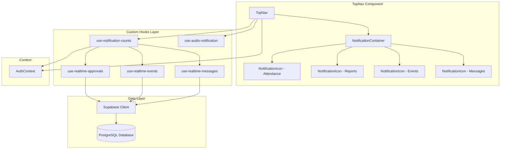

# Design Document: Real-Time Notification Icons

## Overview

This design implements a comprehensive real-time notification system for the Toko 360 Staff Portal TopNav component. The system replaces the non-functional bell icon with role-specific notification icons that display badge counts for pending approvals, status updates, events, and messages.

The design leverages existing real-time infrastructure (`use-realtime-approvals`, `use-realtime-events`, `use-realtime-messages`) and introduces a custom hook (`use-notification-counts`) to aggregate notification data. The system implements role-based visibility, audio notifications with debouncing, and comprehensive accessibility features.

### Key Features

- Role-based notification icons (admin vs staff)
- Real-time badge count updates (<500ms latency)
- Audio notifications for new messages
- Viewed status tracking for staff notifications
- Performance optimizations (memoization, debouncing, batching)
- Full accessibility compliance (WCAG 2.1 AA)
- Theme-aware styling with smooth transitions

### Notification Types

**Admin Users** (role='admin' OR department='Business Intelligence'):
- Attendance Approvals: Count of pending attendance records
- Report Approvals: Count of pending weekly reports

**Staff Users** (all authenticated users):
- Attendance Status: Count of unviewed approved/rejected attendance records
- Report Status: Count of unviewed approved/rejected reports
- Events: Count of unviewed events for user's department
- Messages: Count of unread messages

## Architecture

### High-Level Architecture



### Component Hierarchy

```
TopNav
├── Search Input (existing)
├── NotificationContainer (new)
│   ├── NotificationIcon (Attendance - conditional)
│   ├── NotificationIcon (Reports - conditional)
│   ├── NotificationIcon (Events - conditional)
│   └── NotificationIcon (Messages)
├── Help Button (existing)
└── User Avatar (existing)
```

### Data Flow

1. **Initialization**: TopNav mounts → `use-notification-counts` hook initializes → fetches initial counts from database
2. **Real-Time Updates**: Supabase real-time hooks detect changes → update local state → trigger badge count recalculation
3. **User Interaction**: User clicks notification icon → navigate to target page → mark notifications as viewed → update database
4. **Audio Notification**: New message arrives → debounce check → play sound (if not from current user)

## Components and Interfaces

### 1. NotificationIcon Component

Reusable component for displaying a notification icon with badge count.

**File**: `components/notification-icon.tsx`

**Props Interface**:
```typescript
interface NotificationIconProps {
  icon: React.ComponentType<{ className?: string }>;
  count: number;
  label: string;
  href: string;
  onClick?: () => void;
  hasError?: boolean;
  className?: string;
}
```

**Behavior**:
- Renders icon with badge overlay when count > 0
- Hides badge when count = 0
- Displays error indicator when hasError = true
- Navigates to href on click
- Executes optional onClick callback
- Fully keyboard accessible (Tab, Enter, Space)
- ARIA live region for count changes

**Styling**:
- Uses CSS custom properties for theme compatibility
- Minimum touch target: 44x44px
- Color contrast ratio: 4.5:1
- Smooth transitions (300ms)

### 2. use-notification-counts Hook

Custom hook that aggregates notification counts from multiple sources.

**File**: `hooks/use-notification-counts.ts`

**Interface**:
```typescript
interface NotificationCounts {
  // Admin notifications
  pendingAttendanceApprovals: number;
  pendingReportApprovals: number;
  
  // Staff notifications
  unviewedAttendanceStatus: number;
  unviewedReportStatus: number;
  unviewedEvents: number;
  unreadMessages: number;
  
  // Connection status
  isConnected: boolean;
  hasError: boolean;
  errorMessage: string | null;
}

interface UseNotificationCountsOptions {
  userId: string;
  staffId: string;
  department: string;
  isAdmin: boolean;
}

function useNotificationCounts(options: UseNotificationCountsOptions): NotificationCounts
```

**Responsibilities**:
- Fetch initial counts on mount (single query per type)
- Subscribe to real-time updates via existing hooks
- Debounce count updates (300ms)
- Batch multiple updates within debounce window
- Handle connection errors with retry logic
- Memoize results to prevent unnecessary re-renders

**Implementation Strategy**:
- Use `useState` for count state
- Use `useEffect` for initial data fetching
- Use `useMemo` for derived values
- Use `useCallback` for event handlers
- Implement exponential backoff for retries (1s, 2s, 4s)

### 3. use-audio-notification Hook

Custom hook for playing notification sounds with debouncing.

**File**: `hooks/use-audio-notification.ts`

**Interface**:
```typescript
interface UseAudioNotificationOptions {
  enabled: boolean;
  debounceMs?: number; // default: 3000
}

interface AudioNotificationControls {
  play: () => void;
  canPlay: boolean;
}

function useAudioNotification(options: UseAudioNotificationOptions): AudioNotificationControls
```

**Behavior**:
- Loads audio file from `/public/sounds/notification.mp3`
- Debounces play calls (default: 3000ms)
- Handles browser autoplay restrictions
- Requests permission on first user interaction
- Provides visual feedback when sound plays

### 4. Modified TopNav Component

**File**: `components/top-nav.tsx`

**Changes**:
1. Remove existing bell icon button
2. Add `use-notification-counts` hook
3. Add `use-audio-notification` hook
4. Add role-based rendering logic
5. Add NotificationIcon components
6. Maintain existing functionality (search, help, avatar)

**Role Detection Logic**:
```typescript
const isAdmin = user?.role === 'admin' || user?.department === 'Business Intelligence';
```

## Data Models

### Database Schema Changes

#### 1. attendance_records Table

**New Column**:
```sql
ALTER TABLE attendance_records 
ADD COLUMN notification_viewed BOOLEAN DEFAULT false;
```

**Purpose**: Track whether staff user has viewed approval status notification

**Update Trigger**: Set to `false` when `approval_status` changes to 'approved' or 'rejected'

**Migration File**: `supabase/migrations/add_notification_viewed_to_attendance.sql`

#### 2. weekly_reports Table

**New Column**:
```sql
ALTER TABLE weekly_reports 
ADD COLUMN notification_viewed BOOLEAN DEFAULT false;
```

**Purpose**: Track whether staff user has viewed approval status notification

**Update Trigger**: Set to `false` when `approval_status` changes to 'approved' or 'rejected'

**Migration File**: `supabase/migrations/add_notification_viewed_to_reports.sql`

#### 3. events Table

**New Column**:
```sql
ALTER TABLE events 
ADD COLUMN viewed_by JSONB DEFAULT '[]'::jsonb;
```

**Purpose**: Track which users have viewed each event

**Structure**: Array of user IDs
```json
["user-id-1", "user-id-2", "user-id-3"]
```

**Migration File**: `supabase/migrations/add_viewed_by_to_events.sql`

### TypeScript Type Updates

#### AttendanceRecord Type

```typescript
export interface AttendanceRecord {
  id: string;
  staffId: string;
  date: string;
  checkInTime: string;
  checkOutTime?: string;
  status: AttendanceStatus;
  productivity?: number;
  department: Department;
  approvalStatus?: 'pending' | 'approved' | 'rejected';
  approvedBy?: string;
  approvedAt?: string;
  feedback?: string;
  notificationViewed?: boolean; // NEW
}
```

#### WeeklyReport Type

```typescript
export interface WeeklyReport {
  id: string;
  staffId: string;
  week: string;
  summary: string;
  challenges: string;
  goals: string;
  richContent?: JSONContent;
  formatType?: 'word' | 'spreadsheet' | 'presentation';
  startDate?: string;
  endDate?: string;
  status: ReportStatus;
  approvalStatus?: 'pending' | 'approved' | 'rejected';
  createdAt: number;
  submittedAt?: number;
  reviewedBy?: string;
  reviewedAt?: number;
  feedback?: string;
  department: Department;
  mediaLinks?: MediaLink[];
  notificationViewed?: boolean; // NEW
}
```

#### Event Type

```typescript
export interface Event {
  id: string;
  title: string;
  description: string;
  eventDate: string;
  eventTime: string;
  location: string;
  createdBy: string;
  createdAt: number;
  updatedAt?: number;
  color?: string;
  category?: 'meeting' | 'training' | 'announcement' | 'deadline' | 'webinar' | 'bootcamp' | 'tedx' | 'other';
  targetDepartments?: string[] | null;
  viewedBy?: string[]; // NEW
}
```

### Database Queries

#### Admin: Pending Attendance Approvals

```typescript
const { count } = await supabase
  .from('attendance_records')
  .select('*', { count: 'exact', head: true })
  .eq('approval_status', 'pending');
```

#### Admin: Pending Report Approvals

```typescript
const { count } = await supabase
  .from('weekly_reports')
  .select('*', { count: 'exact', head: true })
  .eq('status', 'submitted')
  .eq('approval_status', 'pending');
```

#### Staff: Unviewed Attendance Status

```typescript
const { count } = await supabase
  .from('attendance_records')
  .select('*', { count: 'exact', head: true })
  .eq('staff_id', staffId)
  .in('approval_status', ['approved', 'rejected'])
  .eq('notification_viewed', false);
```

#### Staff: Unviewed Report Status

```typescript
const { count } = await supabase
  .from('weekly_reports')
  .select('*', { count: 'exact', head: true })
  .eq('staff_id', staffId)
  .in('approval_status', ['approved', 'rejected'])
  .eq('notification_viewed', false);
```

#### Staff: Unviewed Events

```typescript
const { count } = await supabase
  .from('events')
  .select('*', { count: 'exact', head: true })
  .or(`target_departments.is.null,target_departments.cs.{${department}}`)
  .not('viewed_by', 'cs', `{${userId}}`);
```

#### Staff: Unread Messages

```typescript
const { count } = await supabase
  .from('messages')
  .select('*', { count: 'exact', head: true })
  .eq('recipient_id', userId)
  .eq('read', false);
```

### Mark as Viewed Operations

#### Mark Attendance Notifications as Viewed

```typescript
await supabase
  .from('attendance_records')
  .update({ notification_viewed: true })
  .eq('staff_id', staffId)
  .in('approval_status', ['approved', 'rejected'])
  .eq('notification_viewed', false);
```

#### Mark Report Notifications as Viewed

```typescript
await supabase
  .from('weekly_reports')
  .update({ notification_viewed: true })
  .eq('staff_id', staffId)
  .in('approval_status', ['approved', 'rejected'])
  .eq('notification_viewed', false);
```

#### Mark Events as Viewed

```typescript
// Fetch unviewed events
const { data: events } = await supabase
  .from('events')
  .select('id, viewed_by')
  .or(`target_departments.is.null,target_departments.cs.{${department}}`)
  .not('viewed_by', 'cs', `{${userId}}`);

// Update each event to add userId to viewed_by array
for (const event of events) {
  const viewedBy = event.viewed_by || [];
  await supabase
    .from('events')
    .update({ viewed_by: [...viewedBy, userId] })
    .eq('id', event.id);
}
```


## Correctness Properties

*A property is a characteristic or behavior that should hold true across all valid executions of a system—essentially, a formal statement about what the system should do. Properties serve as the bridge between human-readable specifications and machine-verifiable correctness guarantees.*

### Property Reflection

After analyzing all acceptance criteria, I identified the following redundancies:
- Requirements 2.4, 3.4, 5.5, 6.5, 7.5 all test the same behavior (hiding badge when count is zero) - combined into Property 1
- Requirements 2.2, 3.2, 4.2, 5.2, 6.2, 7.2 all test badge count accuracy - each is unique due to different data sources and filters, kept separate
- Requirements 10.4 and 10.5 test the same pattern (resetting notification_viewed on status change) - combined into Property 7

### Property 1: Badge Count Hidden When Zero

*For any* notification icon, when the badge count is zero, the badge indicator should not be visible in the rendered output.

**Validates: Requirements 2.4, 3.4, 5.5, 6.5, 7.5**

### Property 2: Admin Attendance Approval Count Accuracy

*For any* set of attendance records in the database, the attendance approval badge count for admin users should equal the number of records with `approval_status='pending'`.

**Validates: Requirements 2.2**

### Property 3: Admin Report Approval Count Accuracy

*For any* set of weekly reports in the database, the report approval badge count for admin users should equal the number of reports with `status='submitted'` AND `approval_status='pending'`.

**Validates: Requirements 3.2**

### Property 4: Staff Attendance Status Count Accuracy

*For any* staff user and their attendance records, the attendance status badge count should equal the number of records with `approval_status` in ['approved', 'rejected'] AND `notification_viewed=false`.

**Validates: Requirements 4.2**

### Property 5: Staff Report Status Count Accuracy

*For any* staff user and their weekly reports, the report status badge count should equal the number of reports with `approval_status` in ['approved', 'rejected'] AND `notification_viewed=false`.

**Validates: Requirements 5.2**

### Property 6: Event Notification Count Accuracy

*For any* staff user with a specific department, the event notification badge count should equal the number of events where (`target_departments` is null OR `target_departments` contains the user's department) AND the user's ID is not in the `viewed_by` array.

**Validates: Requirements 6.2, 6.6**

### Property 7: Status Change Resets Notification Viewed Flag

*For any* attendance record or weekly report, when the `approval_status` changes to 'approved' or 'rejected', the `notification_viewed` field should be set to false.

**Validates: Requirements 10.4, 10.5**

### Property 8: Message Count Accuracy

*For any* user, the message notification badge count should equal the number of messages where `recipient_id` equals the user's ID AND `read=false`.

**Validates: Requirements 7.2**

### Property 9: Notification Sound Debouncing

*For any* sequence of message arrivals, the notification sound should not play more than once within any 3-second window.

**Validates: Requirements 9.4**

### Property 10: Self-Sent Messages Don't Trigger Sound

*For any* message where the sender ID equals the current user's ID, the notification sound should not play.

**Validates: Requirements 9.6**

### Property 11: Badge Count Reflects Viewed Status

*For any* staff user's notifications (attendance, reports, events), the badge count should only include items where the viewed status indicates the user has not seen them (`notification_viewed=false` or user ID not in `viewed_by`).

**Validates: Requirements 10.10**

### Property 12: No Duplicate Subscriptions

*For any* number of mount/unmount cycles of the TopNav component, the total number of active Supabase subscriptions should never exceed the expected count (one per real-time hook type).

**Validates: Requirements 8.5**

### Property 13: Real-Time Hook Filtering

*For any* real-time update received through the hooks, the update should only be processed if it matches the current user's `staffId` or `userId` filter.

**Validates: Requirements 15.4**

### Property 14: Admin Role Detection

*For any* user object, the user should be classified as admin if and only if `user.role === 'admin'` OR `user.department === 'Business Intelligence'`.

**Validates: Requirements 17.1**

### Property 15: Role-Based Visibility Reactivity

*For any* change to the user object, the notification icons displayed should be re-evaluated to match the new user's role (admin vs staff).

**Validates: Requirements 17.4**

## Error Handling

### Connection Errors

**Strategy**: Display visual error indicators on affected notification icons when real-time connections fail.

**Implementation**:
1. Monitor connection status from each real-time hook
2. Set `hasError` flag when connection status indicates error
3. Pass `hasError` prop to NotificationIcon component
4. Render error indicator (red dot or exclamation mark) on icon
5. Clear error indicator when connection recovers

**Error States**:
- `CHANNEL_ERROR`: Failed to establish connection
- `TIMED_OUT`: Connection attempt timed out
- `CLOSED`: Connection unexpectedly closed

**User Feedback**:
- Visual: Red error indicator on affected icons
- Tooltip: "Connection error - counts may be outdated"
- Console: Detailed error logging for debugging

### Query Failures

**Strategy**: Implement exponential backoff retry logic for failed database queries.

**Retry Schedule**:
1. First retry: 1 second delay
2. Second retry: 2 seconds delay
3. Third retry: 4 seconds delay
4. After 3 failures: Display fallback indicator ("!")

**Fallback Behavior**:
- Display "!" instead of count
- Tooltip: "Unable to load notification count"
- Allow manual refresh via icon click

### Audio Playback Errors

**Strategy**: Handle browser autoplay restrictions gracefully.

**Implementation**:
1. Attempt to play sound on first message
2. If blocked by browser, set flag to request permission
3. On next user interaction (click, keypress), request audio permission
4. Retry sound playback after permission granted
5. Provide visual indicator when sound plays (for deaf users)

**Fallback**:
- If audio permission denied, disable sound feature
- Continue showing visual notifications normally
- Log audio status to console

### Missing User Context

**Strategy**: Gracefully handle cases where user information is unavailable.

**Implementation**:
1. Check if user object exists before rendering notifications
2. If user is null/undefined, render TopNav without notification icons
3. Re-evaluate when user context becomes available
4. Maintain existing TopNav functionality (search, help, avatar)

### Database Schema Validation

**Strategy**: Validate that required database fields exist before querying.

**Implementation**:
1. Check for `notification_viewed` field in attendance_records
2. Check for `notification_viewed` field in weekly_reports
3. Check for `viewed_by` field in events
4. If fields missing, log error and disable affected notifications
5. Provide migration instructions in error message

## Testing Strategy

### Dual Testing Approach

This feature requires both unit tests and property-based tests for comprehensive coverage:

**Unit Tests**: Focus on specific examples, edge cases, and integration points
- Specific user scenarios (admin vs staff)
- Navigation behavior on icon click
- Error state rendering
- Accessibility features (ARIA labels, keyboard navigation)
- Audio permission handling
- Component lifecycle (mount/unmount)

**Property-Based Tests**: Verify universal properties across all inputs
- Badge count accuracy with random data sets
- Notification viewed flag behavior
- Role detection logic
- Debouncing behavior
- Subscription management

### Property-Based Testing Configuration

**Library**: fast-check (for TypeScript/React)

**Configuration**:
- Minimum 100 iterations per property test
- Each test tagged with feature name and property number
- Tag format: `Feature: realtime-notification-icons, Property {N}: {description}`

**Example Test Structure**:
```typescript
import fc from 'fast-check';

// Feature: realtime-notification-icons, Property 2: Admin Attendance Approval Count Accuracy
test('admin attendance approval count matches pending records', () => {
  fc.assert(
    fc.property(
      fc.array(attendanceRecordArbitrary),
      (records) => {
        const pendingCount = records.filter(r => r.approvalStatus === 'pending').length;
        const displayedCount = calculateAttendanceApprovalCount(records);
        expect(displayedCount).toBe(pendingCount);
      }
    ),
    { numRuns: 100 }
  );
});
```

### Unit Test Coverage

**Component Tests**:
1. NotificationIcon component renders correctly
2. Badge displays when count > 0
3. Badge hidden when count = 0
4. Navigation triggered on click
5. Error indicator displays when hasError = true
6. ARIA labels present and correct
7. Keyboard navigation works (Tab, Enter, Space)
8. Touch target size meets 44x44px minimum

**Hook Tests**:
1. use-notification-counts fetches initial counts
2. use-notification-counts updates on real-time events
3. use-notification-counts handles connection errors
4. use-audio-notification debounces play calls
5. use-audio-notification respects enabled flag
6. use-audio-notification handles autoplay restrictions

**Integration Tests**:
1. TopNav renders notification icons for admin users
2. TopNav renders notification icons for staff users
3. TopNav hides notification icons when user is null
4. Clicking attendance icon navigates to /attendance
5. Clicking report icon navigates to /reports
6. Clicking event icon navigates to /events
7. Clicking message icon navigates to /messaging
8. Navigation marks notifications as viewed
9. Real-time updates trigger count changes
10. Audio plays on new message (not from self)

### Test Data Generators

**Arbitrary Generators** (for property-based tests):
```typescript
// Generate random attendance records
const attendanceRecordArbitrary = fc.record({
  id: fc.uuid(),
  staffId: fc.uuid(),
  date: fc.date().map(d => d.toISOString()),
  checkInTime: fc.string(),
  status: fc.constantFrom('on_time', 'late', 'very_late', 'absent'),
  approvalStatus: fc.constantFrom('pending', 'approved', 'rejected'),
  notificationViewed: fc.boolean(),
  department: fc.constantFrom('IT', 'Marketing', 'Finance'),
});

// Generate random weekly reports
const weeklyReportArbitrary = fc.record({
  id: fc.uuid(),
  staffId: fc.uuid(),
  week: fc.string(),
  status: fc.constantFrom('draft', 'submitted', 'approved', 'rejected'),
  approvalStatus: fc.constantFrom('pending', 'approved', 'rejected'),
  notificationViewed: fc.boolean(),
  department: fc.constantFrom('IT', 'Marketing', 'Finance'),
});

// Generate random events
const eventArbitrary = fc.record({
  id: fc.uuid(),
  title: fc.string(),
  targetDepartments: fc.option(fc.array(fc.constantFrom('IT', 'Marketing', 'Finance'))),
  viewedBy: fc.array(fc.uuid()),
});

// Generate random messages
const messageArbitrary = fc.record({
  id: fc.uuid(),
  senderId: fc.uuid(),
  recipientId: fc.uuid(),
  read: fc.boolean(),
  timestamp: fc.integer(),
});

// Generate random users
const userArbitrary = fc.record({
  id: fc.uuid(),
  staffId: fc.string(),
  name: fc.string(),
  role: fc.constantFrom('admin', 'staff', 'instructor'),
  department: fc.constantFrom('IT', 'Marketing', 'Finance', 'Business Intelligence'),
});
```

### Edge Cases to Test

1. **Zero counts**: All notification types with count = 0
2. **Large counts**: Badge display with counts > 99
3. **Rapid updates**: Multiple real-time updates within debounce window
4. **Connection loss**: Real-time hook disconnects and reconnects
5. **Missing fields**: Database records without new fields (backward compatibility)
6. **Null target departments**: Events with null target_departments (all departments)
7. **Empty viewed_by**: Events with empty viewed_by array
8. **Self-sent messages**: Messages where senderId = current userId
9. **No user context**: TopNav rendered before user authentication
10. **Role changes**: User role changes from staff to admin

### Performance Testing

**Metrics to Monitor**:
1. Initial count query time (should be < 200ms per type)
2. Real-time update latency (should be < 500ms)
3. Component re-render frequency (should use memoization)
4. Memory usage (should not leak subscriptions)
5. Audio playback latency (should be < 100ms)

**Performance Benchmarks**:
- Initial load: All counts fetched within 1 second
- Real-time update: Badge count updates within 500ms of database change
- Debouncing: Multiple updates batched within 300ms window
- Audio: Sound plays within 100ms of message arrival
- Memory: No subscription leaks after 100 mount/unmount cycles

### Accessibility Testing

**Manual Testing Required**:
1. Screen reader announces badge count changes
2. Keyboard navigation works without mouse
3. Focus indicators visible on all icons
4. Color contrast meets WCAG 2.1 AA standards
5. Touch targets meet 44x44px minimum
6. Visual indicator appears when sound plays

**Automated Accessibility Tests**:
1. ARIA labels present on all icons
2. ARIA live regions configured for badge counts
3. Semantic HTML structure
4. Keyboard event handlers present
5. Focus management correct

### Integration with Existing Systems

**Regression Tests**:
1. Search input still functional
2. Help icon still functional
3. User avatar still functional
4. Theme transitions still work
5. Responsive design preserved
6. Real-time hooks don't interfere with each other
7. Message conversation loading works
8. Report approval system works
9. Rich text editor theme support works

### Test Execution Strategy

**Development**:
- Run unit tests on every file save
- Run property tests before commit
- Run integration tests before push

**CI/CD Pipeline**:
- Run all unit tests (fast)
- Run property tests with 100 iterations
- Run integration tests
- Run accessibility tests
- Run performance benchmarks
- Generate coverage report (target: 80%+)

**Pre-Release**:
- Manual accessibility testing with screen reader
- Manual testing on multiple browsers
- Manual testing on mobile devices
- Performance profiling in production-like environment
- User acceptance testing with 3+ team members


## Implementation Details

### File Structure

```
components/
├── top-nav.tsx (modified)
└── notification-icon.tsx (new)

hooks/
├── use-notification-counts.ts (new)
├── use-audio-notification.ts (new)
├── use-realtime-approvals.ts (existing)
├── use-realtime-events.ts (existing)
└── use-realtime-messages.ts (existing)

lib/
└── types.ts (modified)

public/
└── sounds/
    └── notification.mp3 (new)

supabase/
└── migrations/
    ├── add_notification_viewed_to_attendance.sql (new)
    ├── add_notification_viewed_to_reports.sql (new)
    └── add_viewed_by_to_events.sql (new)
```

### NotificationIcon Component Implementation

**Key Features**:
- Accepts icon component as prop (lucide-react icons)
- Displays badge overlay with count
- Handles click navigation
- Shows error indicator when connection fails
- Fully accessible with ARIA attributes
- Theme-aware styling

**Props**:
```typescript
interface NotificationIconProps {
  icon: React.ComponentType<{ className?: string }>;
  count: number;
  label: string; // For ARIA label
  href: string; // Navigation target
  onClick?: () => void; // Optional callback before navigation
  hasError?: boolean; // Show error indicator
  className?: string; // Additional styling
}
```

**Rendering Logic**:
1. Render icon with theme-aware colors
2. If count > 0, render badge overlay with count
3. If hasError, render error indicator (red dot)
4. Apply hover/focus styles
5. Handle keyboard events (Enter, Space)

### use-notification-counts Hook Implementation

**State Management**:
```typescript
const [counts, setCounts] = useState<NotificationCounts>({
  pendingAttendanceApprovals: 0,
  pendingReportApprovals: 0,
  unviewedAttendanceStatus: 0,
  unviewedReportStatus: 0,
  unviewedEvents: 0,
  unreadMessages: 0,
  isConnected: false,
  hasError: false,
  errorMessage: null,
});
```

**Initialization Flow**:
1. Check if user context is available
2. Determine if user is admin
3. Fetch initial counts based on role
4. Set up real-time subscriptions
5. Update counts on real-time events

**Debouncing Strategy**:
- Use `useRef` to store pending updates
- Use `setTimeout` to batch updates within 300ms window
- Clear timeout on new updates
- Apply batched updates after debounce period

**Error Handling**:
- Catch query errors and set hasError flag
- Implement exponential backoff for retries
- Log errors to console
- Provide user-friendly error messages

### use-audio-notification Hook Implementation

**Audio Management**:
```typescript
const audioRef = useRef<HTMLAudioElement | null>(null);
const lastPlayedRef = useRef<number>(0);
const [canPlay, setCanPlay] = useState(false);
```

**Initialization**:
1. Create Audio element with notification sound
2. Set up event listeners for load/error
3. Handle autoplay restrictions
4. Request permission on first user interaction

**Play Function**:
1. Check if enabled
2. Check debounce (3 seconds since last play)
3. Attempt to play sound
4. Update lastPlayedRef timestamp
5. Catch and handle playback errors

**Cleanup**:
- Remove event listeners on unmount
- Pause audio if playing
- Clear references

### TopNav Component Modifications

**Changes**:
1. Remove bell icon button and span
2. Add `use-notification-counts` hook
3. Add `use-audio-notification` hook
4. Add role detection logic
5. Add NotificationIcon components
6. Add effect to play sound on new messages
7. Add effect to mark notifications as viewed on navigation

**Role-Based Rendering**:
```typescript
const isAdmin = user?.role === 'admin' || user?.department === 'Business Intelligence';

return (
  <header>
    {/* Existing elements */}
    
    {/* Notification Icons */}
    <div className="flex items-center gap-2">
      {isAdmin && (
        <>
          <NotificationIcon
            icon={ClipboardCheck}
            count={counts.pendingAttendanceApprovals}
            label="Pending attendance approvals"
            href="/admin/approvals/attendance"
            hasError={!counts.isConnected}
          />
          <NotificationIcon
            icon={FileText}
            count={counts.pendingReportApprovals}
            label="Pending report approvals"
            href="/admin/approvals/reports"
            hasError={!counts.isConnected}
          />
        </>
      )}
      
      {!isAdmin && (
        <>
          <NotificationIcon
            icon={CheckCircle}
            count={counts.unviewedAttendanceStatus}
            label="Attendance status updates"
            href="/attendance"
            onClick={markAttendanceAsViewed}
            hasError={!counts.isConnected}
          />
          <NotificationIcon
            icon={FileCheck}
            count={counts.unviewedReportStatus}
            label="Report status updates"
            href="/reports"
            onClick={markReportsAsViewed}
            hasError={!counts.isConnected}
          />
        </>
      )}
      
      <NotificationIcon
        icon={Calendar}
        count={counts.unviewedEvents}
        label="New events"
        href="/events"
        onClick={markEventsAsViewed}
        hasError={!counts.isConnected}
      />
      
      <NotificationIcon
        icon={MessageSquare}
        count={counts.unreadMessages}
        label="Unread messages"
        href="/messaging"
        hasError={!counts.isConnected}
      />
    </div>
    
    {/* Existing elements */}
  </header>
);
```

### Database Migration Scripts

#### Migration 1: Add notification_viewed to attendance_records

```sql
-- Migration: add_notification_viewed_to_attendance.sql
-- Add notification_viewed column to attendance_records table

ALTER TABLE attendance_records 
ADD COLUMN IF NOT EXISTS notification_viewed BOOLEAN DEFAULT false;

-- Create index for efficient querying
CREATE INDEX IF NOT EXISTS idx_attendance_notification_viewed 
ON attendance_records(staff_id, approval_status, notification_viewed)
WHERE approval_status IN ('approved', 'rejected');

-- Create trigger to reset notification_viewed when approval_status changes
CREATE OR REPLACE FUNCTION reset_attendance_notification_viewed()
RETURNS TRIGGER AS $$
BEGIN
  IF (OLD.approval_status IS DISTINCT FROM NEW.approval_status) 
     AND (NEW.approval_status IN ('approved', 'rejected')) THEN
    NEW.notification_viewed := false;
  END IF;
  RETURN NEW;
END;
$$ LANGUAGE plpgsql;

DROP TRIGGER IF EXISTS attendance_approval_status_change ON attendance_records;
CREATE TRIGGER attendance_approval_status_change
  BEFORE UPDATE ON attendance_records
  FOR EACH ROW
  EXECUTE FUNCTION reset_attendance_notification_viewed();

COMMENT ON COLUMN attendance_records.notification_viewed IS 
'Tracks whether staff user has viewed approval status notification';
```

#### Migration 2: Add notification_viewed to weekly_reports

```sql
-- Migration: add_notification_viewed_to_reports.sql
-- Add notification_viewed column to weekly_reports table

ALTER TABLE weekly_reports 
ADD COLUMN IF NOT EXISTS notification_viewed BOOLEAN DEFAULT false;

-- Create index for efficient querying
CREATE INDEX IF NOT EXISTS idx_reports_notification_viewed 
ON weekly_reports(staff_id, approval_status, notification_viewed)
WHERE approval_status IN ('approved', 'rejected');

-- Create trigger to reset notification_viewed when approval_status changes
CREATE OR REPLACE FUNCTION reset_report_notification_viewed()
RETURNS TRIGGER AS $$
BEGIN
  IF (OLD.approval_status IS DISTINCT FROM NEW.approval_status) 
     AND (NEW.approval_status IN ('approved', 'rejected')) THEN
    NEW.notification_viewed := false;
  END IF;
  RETURN NEW;
END;
$$ LANGUAGE plpgsql;

DROP TRIGGER IF EXISTS report_approval_status_change ON weekly_reports;
CREATE TRIGGER report_approval_status_change
  BEFORE UPDATE ON weekly_reports
  FOR EACH ROW
  EXECUTE FUNCTION reset_report_notification_viewed();

COMMENT ON COLUMN weekly_reports.notification_viewed IS 
'Tracks whether staff user has viewed approval status notification';
```

#### Migration 3: Add viewed_by to events

```sql
-- Migration: add_viewed_by_to_events.sql
-- Add viewed_by column to events table

ALTER TABLE events 
ADD COLUMN IF NOT EXISTS viewed_by JSONB DEFAULT '[]'::jsonb;

-- Create index for efficient querying
CREATE INDEX IF NOT EXISTS idx_events_viewed_by 
ON events USING gin(viewed_by);

-- Create function to check if user has viewed event
CREATE OR REPLACE FUNCTION user_has_viewed_event(event_viewed_by JSONB, user_id TEXT)
RETURNS BOOLEAN AS $$
BEGIN
  RETURN event_viewed_by @> to_jsonb(ARRAY[user_id]);
END;
$$ LANGUAGE plpgsql IMMUTABLE;

COMMENT ON COLUMN events.viewed_by IS 
'Array of user IDs who have viewed this event';
```

### Mark as Viewed Functions

**Attendance Notifications**:
```typescript
async function markAttendanceAsViewed(staffId: string): Promise<void> {
  const { error } = await supabase
    .from('attendance_records')
    .update({ notification_viewed: true })
    .eq('staff_id', staffId)
    .in('approval_status', ['approved', 'rejected'])
    .eq('notification_viewed', false);
  
  if (error) {
    console.error('Failed to mark attendance as viewed:', error);
    throw error;
  }
}
```

**Report Notifications**:
```typescript
async function markReportsAsViewed(staffId: string): Promise<void> {
  const { error } = await supabase
    .from('weekly_reports')
    .update({ notification_viewed: true })
    .eq('staff_id', staffId)
    .in('approval_status', ['approved', 'rejected'])
    .eq('notification_viewed', false);
  
  if (error) {
    console.error('Failed to mark reports as viewed:', error);
    throw error;
  }
}
```

**Event Notifications**:
```typescript
async function markEventsAsViewed(userId: string, department: string): Promise<void> {
  // Fetch unviewed events for user's department
  const { data: events, error: fetchError } = await supabase
    .from('events')
    .select('id, viewed_by')
    .or(`target_departments.is.null,target_departments.cs.{${department}}`)
    .not('viewed_by', 'cs', `{${userId}}`);
  
  if (fetchError) {
    console.error('Failed to fetch events:', fetchError);
    throw fetchError;
  }
  
  // Update each event to add userId to viewed_by array
  const updates = events.map(event => {
    const viewedBy = event.viewed_by || [];
    return supabase
      .from('events')
      .update({ viewed_by: [...viewedBy, userId] })
      .eq('id', event.id);
  });
  
  await Promise.all(updates);
}
```

### Notification Sound Asset

**Requirements**:
- Format: MP3 (primary) with OGG fallback
- Duration: 0.5 - 2 seconds
- File size: < 50KB
- Volume: Pleasant, not jarring
- Tone: Corporate, professional

**Recommended Sound**:
- Soft chime or bell tone
- Single note or short melody
- No harsh frequencies
- Royalty-free from sources like:
  - freesound.org
  - zapsplat.com
  - soundbible.com

**Implementation**:
```typescript
// In use-audio-notification.ts
const audio = new Audio('/sounds/notification.mp3');
audio.volume = 0.5; // 50% volume
```

### Performance Optimizations

**Memoization**:
```typescript
// Memoize notification counts to prevent unnecessary re-renders
const memoizedCounts = useMemo(() => counts, [
  counts.pendingAttendanceApprovals,
  counts.pendingReportApprovals,
  counts.unviewedAttendanceStatus,
  counts.unviewedReportStatus,
  counts.unviewedEvents,
  counts.unreadMessages,
]);

// Memoize role detection
const isAdmin = useMemo(
  () => user?.role === 'admin' || user?.department === 'Business Intelligence',
  [user?.role, user?.department]
);

// Memoize callbacks
const handleAttendanceClick = useCallback(() => {
  markAttendanceAsViewed(user.staffId);
}, [user.staffId]);
```

**Debouncing**:
```typescript
// Debounce count updates
const debouncedUpdateCounts = useMemo(
  () => debounce((newCounts: Partial<NotificationCounts>) => {
    setCounts(prev => ({ ...prev, ...newCounts }));
  }, 300),
  []
);
```

**Query Optimization**:
```typescript
// Use count queries instead of fetching full records
const { count } = await supabase
  .from('attendance_records')
  .select('*', { count: 'exact', head: true })
  .eq('approval_status', 'pending');

// Use indexes for efficient filtering
// (created in migration scripts)
```

**Subscription Management**:
```typescript
// Ensure cleanup on unmount
useEffect(() => {
  const channel = supabase.channel('notifications');
  // ... setup subscriptions
  
  return () => {
    supabase.removeChannel(channel);
  };
}, []);
```

### Accessibility Implementation

**ARIA Labels**:
```typescript
<button
  aria-label={`${label}: ${count} ${count === 1 ? 'item' : 'items'}`}
  aria-describedby={hasError ? 'notification-error' : undefined}
>
  {/* Icon and badge */}
</button>
```

**ARIA Live Regions**:
```typescript
<div
  role="status"
  aria-live="polite"
  aria-atomic="true"
  className="sr-only"
>
  {count > 0 && `${count} new ${label}`}
</div>
```

**Keyboard Navigation**:
```typescript
const handleKeyDown = (e: React.KeyboardEvent) => {
  if (e.key === 'Enter' || e.key === ' ') {
    e.preventDefault();
    onClick?.();
    router.push(href);
  }
};
```

**Visual Indicator for Sound**:
```typescript
{isPlaying && (
  <div
    className="absolute -top-1 -right-1 w-3 h-3 rounded-full bg-green-500 animate-pulse"
    aria-label="Sound playing"
  />
)}
```

### Theme Compatibility

**CSS Custom Properties**:
```css
.notification-icon {
  color: var(--theme-text);
  background-color: var(--theme-surface);
  border-color: var(--theme-border);
  transition: all 300ms ease;
}

.notification-badge {
  background-color: var(--theme-accent);
  color: var(--theme-surface);
}

.notification-icon:hover {
  background-color: var(--theme-hover);
  transform: scale(1.05);
}

.notification-error {
  background-color: var(--theme-error, #ef4444);
}
```

**Theme Transition**:
```typescript
// Smooth transition when theme changes
<div
  className="notification-icon"
  style={{
    transition: 'background-color 300ms, color 300ms, border-color 300ms',
  }}
>
  {/* Content */}
</div>
```

## Dependencies

### Existing Dependencies
- React 18+
- Next.js 13+ (App Router)
- Supabase JS Client
- lucide-react (for icons)
- TypeScript

### New Dependencies
- fast-check (for property-based testing)

### No Additional Runtime Dependencies Required

## Deployment Considerations

### Database Migrations
1. Run migrations in order:
   - `add_notification_viewed_to_attendance.sql`
   - `add_notification_viewed_to_reports.sql`
   - `add_viewed_by_to_events.sql`
2. Verify indexes created successfully
3. Test triggers with sample data
4. Backup database before migration

### Asset Deployment
1. Add notification sound file to `public/sounds/`
2. Verify file is accessible at `/sounds/notification.mp3`
3. Test audio playback in production environment
4. Ensure CDN caching configured correctly

### Feature Flags
Consider implementing feature flag for gradual rollout:
```typescript
const ENABLE_NOTIFICATIONS = process.env.NEXT_PUBLIC_ENABLE_NOTIFICATIONS === 'true';

if (ENABLE_NOTIFICATIONS) {
  // Render notification icons
}
```

### Monitoring
1. Track notification count query performance
2. Monitor real-time connection stability
3. Log audio playback errors
4. Track user engagement with notifications
5. Monitor database query load

### Rollback Plan
1. Disable feature via feature flag
2. Remove notification icons from TopNav
3. Keep database migrations (backward compatible)
4. Restore bell icon if needed

## Future Enhancements

### Phase 2 Considerations
1. **Notification History**: Store notification history for audit trail
2. **Notification Preferences**: Allow users to customize notification types
3. **Push Notifications**: Integrate with browser push API
4. **Notification Grouping**: Group related notifications
5. **Snooze Feature**: Allow users to snooze notifications
6. **Priority Levels**: Implement high/medium/low priority
7. **Notification Center**: Dedicated page for all notifications
8. **Email Notifications**: Send email for critical notifications
9. **Mobile App Integration**: Sync with mobile app notifications
10. **Analytics Dashboard**: Track notification engagement metrics

### Scalability Considerations
1. **Caching**: Implement Redis cache for notification counts
2. **Pagination**: Paginate notification history
3. **Archiving**: Archive old notifications
4. **Rate Limiting**: Limit notification frequency per user
5. **Load Balancing**: Distribute real-time connections across servers

